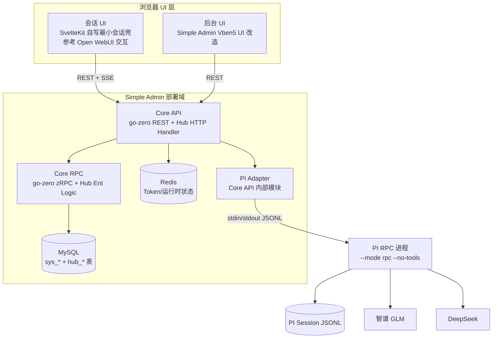
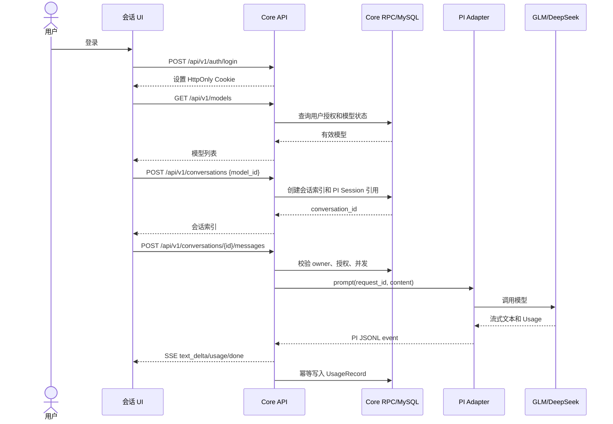

# Terminal Agent Hub 程序设计文档

> 版本：v0.5  
> 日期：2026-09-01  
> 依据：[系统需求文档](./system-requirements.md) v0.4、[任务拆分](./task-breakdown.md)  
> 本版调整：固定 A/B 直接按本文 mock；收紧会话状态、Session 文件路径和首次 prompt 行为。

---

## 0. 设计结论

V1 只实现一条业务链路：

```text
管理员配置模型 → 用户登录 → 用户选择授权模型 → 用户聊天 → 查看历史和用量
```

系统不拥有“Agent”这个业务对象。PI Agent 只是被 Simple Admin 调用的模型执行程序。

本设计不加入：工具、文件、RAG、MCP、Agent 模板、计费、租户、审批、消息队列、Provider 自动切换和 CLI/TUI。

### 0.1 本次源码复用原则

| 项目 | 复用 | 不复用 |
|---|---|---|
| Simple Admin Core | 用户、角色、Token、Casbin、go-zero API/RPC、Ent、MySQL 配置和代码生成方式 | 原样保留全部后台业务，不把系统角色直接当模型授权 |
| Simple Admin Vben5 UI | 登录壳、路由权限、表格、表单、管理布局 | 与本项目无关的菜单和管理页面 |
| Open WebUI | 参考 Chat 布局、流式读取和 Markdown 安全渲染思路 | 默认不复制/裁剪其源码；不使用其 Python/FastAPI 后端、数据库、Provider Key 管理、工具/RAG 等功能 |
| PI | RPC 模式、Session、Provider/Model 适配、流式事件、Usage | TUI、文件读写、bash、Extension、MCP |

Open WebUI 只作为交互参考：其后端已经包含自己的用户、模型、聊天和数据库层，会与 Simple Admin 的身份、授权及 PI Session 事实源重复。会话 UI 默认用 SvelteKit 自写小壳，不复制 Open WebUI 源码。

---

## 1. 源码复核记录

以下项目已实际 clone 到当前项目的 `third_party/` 目录，设计依据为对应源码，而不是仅依据项目介绍。

| 项目 | 源码 | 复核重点 |
|---|---|---|
| Simple Admin Core | `third_party/simple-admin-core` | `api/desc`、`rpc/ent/schema`、go-zero REST/zRPC、Casbin、Redis、Token |
| Simple Admin Vben5 UI | `third_party/simple-admin-vben5-ui` | `apps/simple-admin-core`、登录 Store、路由守卫、请求客户端、管理布局 |
| Open WebUI | `third_party/open-webui` | `src/lib/components/chat/Chat.svelte`、`src/lib/apis/openai`、`src/lib/apis/streaming`、安全渲染 |
| PI | `third_party/pi-mono` | `packages/coding-agent/src/modes/rpc`、`src/core/sdk.ts`、Session、Model/Provider 配置 |

源码快照：

```text
third_party/simple-admin-core       0157f7832bc3cf4d04c11d1718b78d68c64c045c
third_party/simple-admin-vben5-ui   c364d3c
third_party/open-webui              2a960a5
third_party/pi-mono                 b8b873b
```

### 1.1 复用后的重要事实

#### Simple Admin

Simple Admin Core 不是一个单体目录，而是已经分成：

```text
core-api  --REST-->  core-rpc  --Ent-->  MySQL
    │                   │
    └── JWT/Casbin      └── Redis/业务数据
```

它已有：

- `/user/login`、`/user/info`、`/user/logout`、`/user/refresh_token`；
- `sys_users`、`sys_roles`、`sys_tokens` 等 Ent Schema；
- go-zero REST 和 zRPC/gRPC 代码生成方式；
- Casbin 路由权限；
- Redis 配置和 Token 相关能力；
- Vben5 UI 的登录 Store、动态路由和权限码加载。

因此本项目不重新写基础登录和系统角色，只在其上增加 Hub 业务。

#### Open WebUI

可参考的实现位置：

- `src/lib/components/chat/Chat.svelte`：聊天输入、增量回复、停止生成和会话交互；
- `src/lib/apis/streaming/index.ts`：SSE/ReadableStream 消费逻辑；
- `src/lib/utils/index.ts`：Markdown 和 DOMPurify 安全处理；
- `backend/open_webui/utils/access_control`：用户授权和组授权取并集的思路。

本项目默认不复制这些文件，而是用 SvelteKit 自写最小会话 UI。Open WebUI 的实现只用于校验交互和安全要求。

#### PI

PI 当前源码提供：

- `pi --mode rpc`；
- stdin/stdout 严格 LF 分隔 JSONL；
- `prompt`、`abort`、`get_state`、`get_available_models`、`get_entries`；
- `message_update`、`agent_settled` 等事件；
- `--no-tools` 关闭全部工具；
- JSONL Session 树和稳定 Entry ID；
- `models.json` 自定义 Provider/Model；
- `DEEPSEEK_API_KEY`、`ZAI_API_KEY` 等 Provider 凭据发现，以及通过受保护配置注入 Key 的能力。

### 1.2 许可证注意事项

- Simple Admin Core 和 Vben5 UI：Apache-2.0；
- PI：MIT；
- Open WebUI：本项目默认不复制其源码，因此其品牌限制不适用；仅保留对其许可证和版权归属的记录。

---

## 2. 静态架构图

完整图见：[static-architecture.svg](./static-architecture.svg)。基于实际 Simple Admin 结构，V1 静态架构如下：



### 2.1 为什么保留 Core API/Core RPC

这不是额外的微服务设计，而是复用 Simple Admin 已有代码结构：

- Core API 负责 HTTP、Cookie、路由权限和 SSE；
- Core RPC 负责 Ent 数据访问和普通 CRUD；
- PI Adapter 放在 Core API 内，因为 SSE 必须直接消费 PI 流；
- 两者仍然是一个 Simple Admin 代码仓库和一个部署方案，不增加独立 Hub 服务。

### 2.2 密钥和数据边界

- 浏览器 → Core API；浏览器不接触 PI 和 Provider；
- Core API/Core RPC/MySQL/Redis 不保存 Provider Key；
- Provider Key 只注入 PI 进程；
- MySQL 只保存 `pi_session_ref`，不保存会话全文；
- PI Session 文件只由 PI 目录和 PI Adapter 访问；
- PI 内部 RPC 不能被外部 HTTP 路由代理出去。

---

## 3. 技术设计和代码落点

### 3.1 后端

基于 `third_party/simple-admin-core` fork 改造，不新建后端框架。

本仓库根布局固定如下，四个 Agent 不各自创建另一套工程：

```text
session-ui/                         # A：自写 SvelteKit 会话 UI
admin-ui/                           # B：Vben5 改造的后台 UI
backend/                            # C+D：fork 的 Simple Admin Core
├── api/desc/hub.api                # C：唯一对外 Hub REST/SSE 契约落点
├── api/internal/logic/hub/         # C：Hub 用例和编排
├── api/internal/pi/                # D：PI 进程和 JSONL Adapter
├── rpc/ent/schema/hub_*.go         # C：Hub 表
├── rpc/internal/logic/hub/         # C：Hub 数据读写
└── deploy/docker-compose/          # C：core-api、core-rpc、MySQL、Redis

docs/
```

C/D 都在 `backend/` 内工作，但包边界固定：D 只改 `api/internal/pi/`；C 负责 `api/desc/hub.api`、生成的 Hub Handler、`api/internal/logic/hub/`、`rpc/ent/schema/hub_*.go` 和对应 Hub 数据代码；两者不互改对方包。

规则：

- 现有 `sys_users`、`sys_roles`、`sys_tokens` 继续作为身份基础；
- `sys_roles` 只判断 `admin/user` 和后台入口，不表示模型授权；
- Model 授权由 Hub 自己计算；
- 业务用例通过接口依赖 Repository、Clock、ID Generator 和 PI Adapter，测试时注入 fake；
- 不将 Open WebUI Python 代码引入 Go 后端。

### 3.2 会话 UI

默认用 SvelteKit 自写最小页面壳，只参考 Open WebUI 的布局和交互：

- 保留左侧会话列表、模型选择、消息列表、输入框、停止按钮；
- 使用 `fetch` + `ReadableStream` 消费 SSE，不使用 `EventSource`；
- 使用安全 Markdown 渲染，消息中的脚本不得执行；
- 使用 `credentials: include` 携带 Simple Admin HttpOnly Cookie；
- 不让前端拼接或发送 Provider 信息、PI 路径和内部配置；
- 不引入 Open WebUI Python 后端及其数据库。

### 3.3 后台 UI

从 `third_party/simple-admin-vben5-ui/apps/simple-admin-core` 改造：

- 沿用登录页、请求客户端、动态路由和权限守卫；
- 沿用表格、表单、分页、通知和布局组件；
- 删除与 V1 无关的部门、岗位、字典、文件、消息等菜单；
- 增加用户组、Provider/Model、模型授权、用量、会话审阅、审计页面；
- Admin API 的权限由后端 Casbin/角色强制执行，前端菜单只负责体验。

### 3.4 PI Adapter

默认使用进程 RPC，而不是把 PI 代码改写成 Go：

```text
启动：`pi --mode rpc --no-tools --session-dir <PI_DATA_DIR> --session <PI_DATA_DIR>/<pi_session_ref>.jsonl`
输入：一行一个 JSON 命令
输出：一行一个 JSON response/event
```

V1 接入层只保留进程 JSONL。

---

## 4. 最小业务对象和数据库

### 4.1 复用的 Simple Admin 表

| 表 | 用途 |
|---|---|
| `sys_users` | 用户名、密码哈希、状态、用户 ID |
| `sys_roles`及用户角色关系 | `admin/user` 角色及后台入口权限 |
| `sys_tokens` + Redis | Token 轮换、撤销和运行时状态 |

Simple Admin 现有用户字段较丰富，Hub 不重复建用户表。

### 4.2 新增 Hub 表

| 表 | 关键字段 | 说明 |
|---|---|---|
| `hub_groups` | `id`、`name`、`status` | 用户组 |
| `hub_group_members` | `group_id`、`user_id` | 多对多成员关系 |
| `hub_providers` | `provider`、`name`、`status`、`last_synced_at` | PI 无密钥登记快照；`status` 至少支持 `active` / `stale` |
| `hub_models` | `id`、`provider`、`upstream_model_id`、`name`、`enabled`、`available` | 模型目录 |
| `hub_grants` | `subject_type`、`subject_id`、`model_id` | 用户/组模型授权 |
| `hub_conversations` | `id`、`owner_id`、`model_id`、`pi_session_ref`、`title`、`hidden` | 会话索引；`status` 不入库，由 API 根据授权和 Redis 生成锁计算 |
| `hub_usage_records` | `request_id`、`conversation_id`、`user_id`、`model_id`、`status`、Token 字段 | 一次调用一条记录 |
| `hub_audit_logs` | `actor_id`、`action`、`object_type`、`object_id`、`result`、`trace_id` | 操作和审阅审计 |

约束：

- `hub_models(provider, upstream_model_id)` 唯一；
- 一个会话绑定一个模型，创建后不修改；
- `hub_usage_records.request_id` 唯一，保证幂等；
- `pi_session_ref` 只保存相对名或不透明 ID，不保存绝对路径，也不返回给浏览器；Adapter 运行时将它拼接到 `PI_DATA_DIR`；
- 会话全文不进入 MySQL；
- `status` 只在列表/详情响应中计算：会话的 `model_id` 不在当前有效模型中时为 `readonly`，Redis 存在该会话生成锁时为 `generating`，否则为 `active`；`generating` 优先级高于 `readonly`；
- 撤销模型授权只影响下次状态计算和新消息校验，不回写会话行。

### 4.3 有效模型计算

```text
候选 = 直接给用户的 Grant ∪ 用户所属组的 Grant
有效 = 候选 ∩ hub_models.enabled ∩ hub_models.available
```

只有这一份计算函数。`GET /models` 和发送消息前的校验必须共同调用它。

---

## 5. 业务场景和业务流程

只保留三个场景。

### 5.1 用户聊天

```text
登录
 → 获取有效模型
 → 创建会话
 → 发送消息
 → PI 流式生成
 → 页面展示回复
 → 保存会话索引和用量
```

发送消息前服务端检查：用户 active、会话 owner、模型有效、当前没有生成、并发未超限。

### 5.2 管理员授权

```text
管理员登录后台
 → 同步 PI 模型清单
 → 启用模型
 → 给用户/用户组增加授权
 → 用户下次获取模型列表即可使用
```

不做审批，不做授权申请，不做 Deny 规则。

### 5.3 管理员审阅

```text
管理员打开会话列表
 → 选择会话
 → 先写审阅审计
 → 从 PI 读取消息
 → 过滤内部字段
 → 按 `since` 游标分段展示
```

### 5.4 用户聊天时序



### 5.5 生成编排

生成状态只在 Redis 维护，不增加锁表。用户和系统并发上限由 Core API 环境变量提供（例如 `TAH_MAX_INFLIGHT_PER_USER`、`TAH_MAX_INFLIGHT_SYSTEM`），不做后台配置页：

1. 发送消息前以 `conversation_id` 获取 Redis 生成锁；已有锁直接返回 `409 CONVERSATION_BUSY`，不排队；
2. 获取用户和系统并发计数，超过上限返回 `429 CONCURRENCY_LIMIT`；
3. 锁、计数和断线计时都由 Core API 管理，数据库只保存最终会话索引和用量；
4. 客户端断线后 PI 继续生成；连续 120 秒没有 SSE 读者，Core API 调用 PI `abort`；
5. 用户重连只调用 `GET .../messages` 读取已持久化结果，不重放 PI 内部事件；
6. `agent_settled` 到达后才释放 Redis 锁和并发计数，并幂等写入 UsageRecord；
7. PI 异常退出也必须清理锁，并将会话和用量置为明确失败状态。

---

## 6. 外部 REST API 契约

### 6.1 约定

- 基础路径：`/api/v1`；
- JSON 请求/响应，时间使用 UTC ISO 8601；
- 认证使用 HttpOnly Cookie；
- 统一错误结构；
- 普通列表使用 `page`（从 1 开始）；会话正文使用 `since` 游标和 `limit`，不伪装成页码分页；
- 普通用户只能访问自己的会话和用量；
- 后端权限校验不能依赖前端隐藏按钮。

Simple Admin 原有 `/sys-api/user/*` 保留在内部兼容层；对本项目两个 SPA 暴露稳定的 `/api/v1/auth/*` 契约，Handler 内部复用 Simple Admin 的认证逻辑，不向浏览器返回原始 Token 字符串。

### 6.2 认证

#### `POST /auth/login`

```json
{"username":"alice","password":"password"}
```

成功 `200`，并设置 Cookie：

```json
{"user":{"id":"u_1","username":"alice","role":"user"}}
```

密码错误 `401`，账号禁用 `403`，登录限流 `429`。

#### `POST /auth/refresh`

轮换 Cookie 中的 Refresh Token。用户禁用或 Token 撤销时返回 `401`。

#### `POST /auth/logout`

撤销当前 Refresh Token，返回 `204`。

#### `GET /auth/me`

```json
{"id":"u_1","username":"alice","role":"user","status":"active"}
```

### 6.3 用户侧接口

| 方法 | 路径 | 用途 |
|---|---|---|
| `GET` | `/models` | 当前用户有效模型 |
| `POST` | `/conversations` | 按 `model_id` 新建会话 |
| `GET` | `/conversations` | 当前用户未隐藏会话 |
| `PATCH` | `/conversations/{id}` | 修改自己的标题 |
| `DELETE` | `/conversations/{id}` | 对自己隐藏 |
| `GET` | `/conversations/{id}/messages?since={entry_id}&limit=50` | 按 PI Entry 游标读取可见消息 |
| `POST` | `/conversations/{id}/messages` | 发送消息，响应 SSE |
| `POST` | `/conversations/{id}/abort` | 中止当前生成；无生成时返回 `409 NO_ACTIVE_GENERATION` |
| `GET` | `/usage?from=&to=&model_id=` | 当前用户按时间/模型筛选用量 |

#### 模型列表

```json
{
  "items":[
    {"id":"m_1","name":"GLM-4-Flash","provider":"glm","upstream_model_id":"glm-4-flash"}
  ]
}
```

#### 创建会话

请求：

```json
{"model_id":"m_1"}
```

该请求只创建 MySQL 会话索引和不透明的 `pi_session_ref`，不启动 PI、不创建 Session 文件；第一次发送消息时才 exec PI 并落盘 Session。

成功 `201`：

```json
{"id":"c_1","model_id":"m_1","title":"新会话","status":"active"}
```

#### 读取消息

请求使用 PI Entry 游标；首次读取不传 `since`，后续使用上次返回的 `next_since`：

```text
GET /api/v1/conversations/c_1/messages?since=entry_abc&limit=50
```

```json
{
  "items":[
    {"id":"entry_def","role":"user","content":"你好","status":"completed","created_at":"2026-09-01T10:00:00Z"},
    {"id":"entry_ghi","role":"assistant","content":"你好！","status":"completed","created_at":"2026-09-01T10:00:02Z"}
  ],
  "next_since":"entry_ghi",
  "has_more":false
}
```

Adapter 将 `since` 原样映射为 PI `get_entries(since=entry_id)`，再过滤消息和截取 `limit`。

#### 用量查询

- 用户：`GET /api/v1/usage?from=2026-09-01T00:00:00Z&to=2026-09-30T23:59:59Z&model_id=m_1`；
- 管理员：`GET /api/v1/admin/usage?from=...&to=...&user_id=u_1&model_id=m_1`；
- `from`、`to`、`model_id` 是可选筛选项，`user_id` 仅管理员可用；
- Provider 未返回的 Token 在 SSE 和用量接口中均为 `null`，不估算。

### 6.4 管理员接口

以下接口全部要求 `admin` 角色：

| 方法 | 路径 | 用途 |
|---|---|---|
| `GET/POST/PATCH` | `/admin/users` | 复用 Simple Admin 用户管理能力 |
| `GET/POST/PATCH` | `/admin/groups` | 用户组和成员 |
| `GET` | `/admin/providers` | 无密钥 Provider 快照 |
| `POST` | `/admin/providers/sync` | 同步 PI 模型清单 |
| `GET/PATCH` | `/admin/models` | 查看、启停 Model |
| `GET/POST/DELETE` | `/admin/grants` | 用户/组模型授权 |
| `GET` | `/admin/users/{id}/effective-models` | 预览有效模型 |
| `GET` | `/admin/usage?from=&to=&user_id=&model_id=` | 管理员按时间/用户/模型筛选全局用量 |
| `GET` | `/admin/conversations` | 全部会话索引，含用户隐藏会话 |
| `GET` | `/admin/conversations/{id}/messages?since={entry_id}&limit=50` | 按 PI Entry 游标读取正文并写审阅审计 |
| `GET` | `/admin/audit` | 查看审计 |

管理员接口是对 Simple Admin 原有接口的稳定包装，不复制用户数据：

- `POST /admin/users` 转换为 Simple Admin 的用户创建；
- `PATCH /admin/users/{id}` 的 `status=active|disabled` 转换为用户启用/禁用；
- `POST /admin/users/{id}/reset-password` 由管理员设置新密码，调用 Simple Admin 用户更新逻辑；
- 禁用用户立即不能登录，已有 Refresh Token 不能刷新。

组成员批量变更使用一个请求：

```http
PATCH /api/v1/admin/groups/g_1/members
Content-Type: application/json

{"add_user_ids":["u_1","u_2"],"remove_user_ids":["u_3"]}
```

模型授权请求明确区分用户和用户组：

```http
POST /api/v1/admin/grants
Content-Type: application/json

{"subject_type":"group","subject_id":"g_1","model_id":"m_1"}
```

直接给单个用户授权时：

```json
{"subject_type":"user","subject_id":"u_1","model_id":"m_1"}
```

`subject_type` 只能是 `user` 或 `group`；删除授权使用同样的三项定位授权关系。

Provider/Model 响应只允许：`provider`、`name`、`status`、`models`、`last_synced_at`、`id`、`upstream_model_id`、`enabled`、`available`。不能出现 `key`、`token`、`secret`、认证头、PI 路径。

### 6.5 错误结构

```json
{
  "error": {
    "code":"MODEL_NOT_AUTHORIZED",
    "message":"当前用户无权使用该模型",
    "request_id":"req_123"
  }
}
```

| HTTP | 错误码 | 含义 |
|---|---|---|
| 401 | `UNAUTHENTICATED` | 未登录或 Token 无效 |
| 403 | `FORBIDDEN` / `MODEL_NOT_AUTHORIZED` | 角色或模型授权不足 |
| 404 | `NOT_FOUND` | 不存在或对当前用户不可见 |
| 409 | `CONVERSATION_BUSY` / `NO_ACTIVE_GENERATION` | 同一会话已有生成 / 中止时当前无生成 |
| 429 | `CONCURRENCY_LIMIT` / `LOGIN_RATE_LIMITED` | 并发或登录限流 |
| 502 | `PI_UNAVAILABLE` / `PROVIDER_ERROR` | PI 或 Provider 失败 |
| 504 | `PROVIDER_TIMEOUT` | Provider 超时 |

---

## 7. SSE 契约

`POST /conversations/{id}/messages` 响应 `Content-Type: text/event-stream`。

```text
event: text_delta
data: {"request_id":"req_1","conversation_id":"c_1","delta":"你好"}

event: usage
data: {"request_id":"req_1","input_tokens":12,"output_tokens":3,"total_tokens":15}

event: done
data: {"request_id":"req_1","finish_reason":"stop"}
```

失败：

```text
event: error
data: {"request_id":"req_1","code":"PROVIDER_TIMEOUT","message":"模型服务暂时不可用"}
```

规则：

1. `done` 和 `error` 互斥，一次请求只出现一个终止事件；
2. `usage` 可选；Provider 未返回的 Token 使用 `null` 或省略，UsageRecord 也保持未知，不伪造估算值；
3. 只传最终可展示文本，不传 thinking、tool call、PI 控制事件；
4. 用户中止后发送 `done(finish_reason=aborted)`；
5. `request_id` 是全链路幂等键；
6. `agent_settled` 到达后才释放会话活动锁。

---

## 8. PI RPC 对接契约

### 8.1 启动参数和进程用途

PI 不是常驻 daemon，由 PI Adapter 按用途启动和回收：

- **聊天**：一次生成对应一个 PI RPC 进程；收到 `agent_settled` 后立即杀掉进程，Session 文件保留，下次消息用同一文件再拉起；
- **模型同步**：临时拉起短生命周期控制进程，使用 `--no-session` 执行 `get_available_models` 后立即退出；
- 两种进程都使用 `--no-tools`，不提供文件、命令或 Extension 工具；
- PI CLI 放入 `core-api` 镜像，Compose 不增加独立的常驻 PI 容器。

聊天进程示意：

```text
pi --mode rpc --no-tools --session-dir <PI_DATA_DIR> \
   --session <PI_DATA_DIR>/<pi_session_ref>.jsonl \
   --provider <provider> --model <provider/model-id>
```

首次 prompt 前，Adapter 将相对的 `pi_session_ref` 解析为唯一文件 `{PI_DATA_DIR}/{pi_session_ref}.jsonl`，通过显式 `--session` 交给 PI；文件不存在时就在这个路径创建。Adapter 不让 PI 使用默认文件名。恢复已有会话始终使用同一显式路径；`switch_session` 只在 Adapter 内部使用真实路径，绝对路径不入库、不返回浏览器。

### 8.2 使用的 PI 命令

| 目的 | PI RPC 命令 |
|---|---|
| 获取模型 | `get_available_models` |
| 获取状态 | `get_state` |
| 发消息 | `prompt`，包含平台 `request_id` |
| 中止 | `abort` |
| 读正文 | `get_entries(since=entry_id)`，Adapter 过滤和截取 |

严格按 LF 分割 JSONL；不能使用会把 U+2028/U+2029 当换行的通用读取器。

### 8.3 事件转换

| PI 事件 | Hub 处理 |
|---|---|
| `message_update.assistantMessageEvent.type=text_delta` | SSE `text_delta` |
| `message_update.usage` | 暂存 Usage，可发 SSE `usage` |
| `message_end` | 更新当前助手消息，不释放活动锁 |
| `agent_settled` | 生成结束、释放活动锁、写 UsageRecord |
| `stopReason=aborted` | SSE `done(finish_reason=aborted)` |
| PI 进程异常或 Provider 错误 | SSE `error`，写失败记录 |

### 8.4 PI Session 到平台消息

PI Session 是 append-only JSONL 树，Entry 有 `id`、`parentId`、`timestamp`。Adapter 只输出：

- `role=user` 的文本消息；
- `role=assistant` 内容中的 `text`；
- 时间和完成状态。

过滤：

- thinking 内容；
- tool call 和 tool result；
- bash、文件路径、内部控制事件；
- Provider Key、认证头、错误堆栈。

### 8.5 Provider 配置

优先使用 PI 的 `models.json` 统一定义 Provider 和模型。示意：

```json
{
  "providers": {
    "glm": {
      "baseUrl": "https://实际使用的 GLM Base URL/v1",
      "api": "openai-completions",
      "apiKey": "$GLM_API_KEY",
      "models": [{"id":"glm-4-flash","name":"GLM-4-Flash"}]
    },
    "deepseek": {
      "baseUrl": "https://api.deepseek.com/v1",
      "api": "openai-completions",
      "apiKey": "$DEEPSEEK_API_KEY",
      "models": [{"id":"deepseek-chat","name":"DeepSeek Chat"}]
    }
  }
}
```

实际 Provider ID、Base URL、Model ID 以 B10 fixture 和部署区域确认结果为准。PI 文档已确认 `apiKey` 支持环境变量解析；凭据文件应保持 `0600`，或使用 Compose Secret/受保护文件挂载。

同步规则：

- 新模型 `enabled=false`；
- 清单暂时缺少的模型设 `available=false`，不删除授权；
- 同步失败保留旧快照并标记过期；
- 字段采用白名单映射，不能透传完整 PI Model 对象。

---

## 9. 认证和权限设计

### 9.1 身份和 Cookie

- 复用 Simple Admin 用户密码哈希和 Token 实现；
- 首个管理员由初始化脚本创建；
- 不开放注册、忘记密码；
- Cookie 名称固定为 `tah_access`、`tah_refresh`；
- Cookie 设置 `HttpOnly`、`SameSite=Lax`；生产环境设置 `Secure`，本地 HTTP 可关闭；
- 两个 SPA 通过同域反向代理访问 Core API，避免跨站 Cookie/CORS；同站部署不再引入独立 CSRF 框架；
- Refresh Token 轮换并可撤销；
- Redis 用于 Token、生成锁、并发计数和断线计时。

### 9.2 两种权限

1. **系统权限**：Simple Admin 角色和 Casbin，判断是否可访问后台 API；
2. **模型权限**：Hub Grant，按用户直接授权和用户组授权计算有效模型。

两者不混用。管理员也不自动拥有所有模型。

### 9.3 会话权限

- 用户只能读取自己的 Conversation；
- 用户删除是 `hidden=true`，不是物理删除；
- 管理员可读取所有 Conversation；
- 管理员读取正文前先写审阅审计，成功和失败都记录；
- 失去模型授权后历史可读，但新消息被拒绝；
- 读取正文必须使用 `since` 游标和 `limit` 分段，不使用伪页码。

---

## 10. 部署形态

基于 Simple Admin Core 已有 Compose 结构裁剪：

```text
core-api（镜像内包含 PI CLI）
core-rpc
session-ui
admin-ui
mysql
redis
```

PI 不是独立常驻容器。Core API 的 PI Adapter 在需要时 exec `pi --mode rpc --no-tools` 子进程；进程退出后 Session 文件仍保留。V1 不启动 Simple Admin 的 FMS、Job、MCMS 等无关模块。

要求：

- MySQL、Redis、PI Session 使用持久卷；
- Core API/RPC 启动前执行迁移；
- 首个管理员由环境变量或初始化脚本创建；
- Provider Key 不放命令行参数；
- PI 凭据文件权限最小化；
- Core API、Core RPC、MySQL、Redis 有健康检查；PI 子进程由 Adapter 监控退出状态；
- 生产环境 HTTPS；
- 两个 UI 推荐同一域名路径发布，减少 Cookie/CORS 复杂度。

---

## 11. 关键测试边界

### 11.1 测试边界

- Simple Admin/Vben5：沿用其认证、Token、Casbin、登录、路由守卫和表单测试方式；
- Open WebUI：只参考流式文本消费和 Markdown 安全渲染思路，不运行其 Python/Svelte 全量测试；
- PI：使用 RPC JSONL、事件和 Session 格式制作本项目自己的 fixture。

### 11.2 本项目必须新增的测试

1. 有效模型：用户直接授权、组授权、多组并集、撤销立即生效；
2. 会话归属：跨用户访问拒绝，用户软删除后管理员仍可查看；
3. PI Adapter：一次生成一个进程、`agent_settled` 后立即退出、下次用同一 Session 恢复、`prompt`、`abort`、JSONL 粘包和进程异常；
4. 生成编排：同会话重复发送返回 409，用户/系统超并发返回 429，断线 120 秒后 abort，重连只 `GET messages`；
5. SSE：`done/error` 互斥，`agent_settled` 后释放锁，重复事件不重复记账；
6. 密钥：HTTP、数据库、日志、Session 展示结果无 Key；
7. Provider fixture：GLM/DeepSeek 的正常流、401、429、5xx、超时和 Usage 缺失；
8. 安全渲染：消息中的脚本不执行。

---

## 12. 并行实施方式

按 `task-breakdown.md` 的四个 Agent 并行，前端使用 mock 自闭环，后端使用单测和 fake，自身完成不等待另一端：

| Agent | 负责 | 对应任务 |
|---|---|---|
| A | 会话 UI：SvelteKit 自写小壳、登录、模型、聊天、历史和用量 | F0、F1、F5、F6、F7、F9 |
| B | 后台 UI：Vben5 改造、登录、用户组、授权、审阅和审计 | F0、F2、F3、F4、F8、F9 |
| C | Simple Admin：Core API/RPC、Hub 数据、认证包装、授权、编排、审计、Compose | C0、B0、B1、B2、B3、B4、B5、B7、B8、B9、B11 |
| D | PI：JSONL Adapter、Provider fixture 和 PI 镜像集成 | B6、B10 |

C 的后端内部最短顺序可以是：骨架/认证 → 模型和授权 → 会话索引 → PI 编排/SSE → 用量/审计 → Compose。这个顺序只约束 C，其他 Agent 仍按各自任务并行。

A/B 直接对着本文 §6–§7 写 mock；C/D 用 fake PI 和 mock HTTP，不把真实 Key 或真实 Provider 放进默认测试。阶段 4 再由 Compose 交给产品体验。

## 13. 仍需确认

只保留影响实现的事项：

- GLM 的 Provider ID、区域、Base URL 和具体 Model ID；
- 会话正文保留天数；
- 部署环境的硬件和并发目标。

## 14. 主要源码和文档来源

- [Simple Admin Core](https://github.com/suyuan32/simple-admin-core)
- [Simple Admin Vben5 UI](https://github.com/suyuan32/simple-admin-vben5-ui)
- [Open WebUI Chat.svelte](https://github.com/open-webui/open-webui/blob/main/src/lib/components/chat/Chat.svelte)
- [Open WebUI streaming](https://github.com/open-webui/open-webui/blob/main/src/lib/apis/streaming/index.ts)
- [Open WebUI model access](https://github.com/open-webui/open-webui/blob/main/backend/open_webui/utils/access_control/__init__.py)
- [PI RPC](https://github.com/earendil-works/pi/blob/main/packages/coding-agent/docs/rpc.md)
- [PI Session Format](https://github.com/earendil-works/pi/blob/main/packages/coding-agent/docs/session-format.md)
- [PI Models](https://github.com/earendil-works/pi/blob/main/packages/coding-agent/docs/models.md)
- [PI Providers](https://github.com/earendil-works/pi/blob/main/packages/coding-agent/docs/providers.md)
