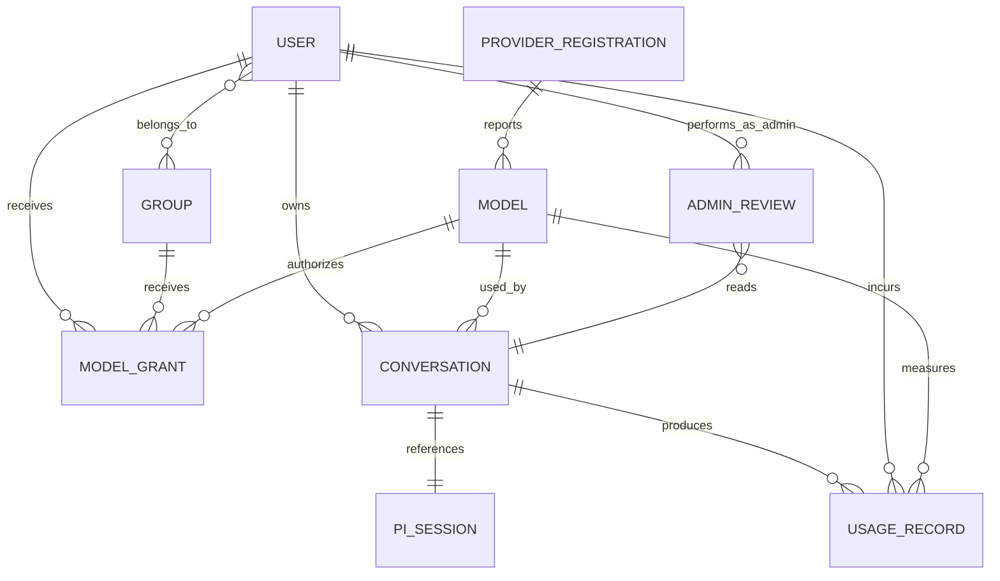

# Terminal Agent Hub 系统需求文档

> 文档版本：v0.4（最小化修订）  
> 更新日期：2026-09-01  
> 产品定位：面向单个组织的多用户模型使用与会话管理平台  
> 架构事实源：[static-architecture.svg](./static-architecture.svg)


---

## 1. 目的与基线结论

本文定义 Terminal Agent Hub V1 的产品范围、业务对象、功能需求、验收标准和交付边界。架构与术语以最新 SVG 为准。

V1 基线结论：

1. 系统由四层组成：两套 Web UI、Simple Admin 后端、PI Agent、模型提供商；
2. 会话 UI 和后台 UI 是同一 UI 层中的两套独立前端，共用 Simple Admin 身份认证；
3. 平台分发的是**模型使用权**，不是 Provider API Key；
4. Simple Admin 管理用户、用户组、模型授权、用量、会话索引和审计；
5. PI Agent 执行真实对话、保存会话正文并调用智谱 GLM 或 DeepSeek；
6. Provider Key 只配置在 PI Agent 侧，不进入 Simple Admin、浏览器或业务数据库；
7. V1 是纯模型对话产品，不引入 Agent 配置、工具、Extension、RAG、MCP 或终端客户端；
8. V1 按“一套部署服务一个组织”设计，用户组不是租户。

### 1.1 本版采用的产品默认值

以下默认值用于收口 V1；若产品决策变化，应先更新本文再实施：

| 事项 | V1 默认值 |
|---|---|
| 对话对象 | 用户选择已授权 Model，不配置独立 Agent。 |
| PI 工具 | 不开放 `bash`、`read`、`write` 等工具，也不加载业务 Extension。 |
| 客户端 | 只提供会话 UI 和后台 UI，不提供 CLI/TUI。 |
| 角色 | 普通用户、管理员两级。 |
| 管理员聊天 | 管理员可进入会话 UI；只有管理员可进入后台 UI。 |
| Provider Key | 由运维人员在 PI Agent 侧配置，Simple Admin 只同步无密钥登记。 |
| 会话正文 | PI Session 是正文事实源；Simple Admin 只保存索引和归属。 |
| 会话删除 | 用户删除仅对自己隐藏；PI Session 保留供管理员审阅，按保留期统一清理。 |
| 用量控制 | V1 只记账和查看；仅对并发执行硬限制。 |

---

## 2. 产品定义

Terminal Agent Hub 让组织集中接入 GLM、DeepSeek 等模型，并按用户或用户组分配模型使用权。用户通过会话 UI 聊天，管理员通过后台 UI 管理授权、查看用量和审阅会话。模型密钥始终留在 PI Agent 层。

### 2.1 两套 Web 入口

| 前端 | 访问者 | 登录后页面 | 核心职责 |
|---|---|---|---|
| 会话 UI | 普通用户、管理员 | Open WebUI 风格 Web Chat | 选择已授权模型、流式对话、查看自己的历史和用量。 |
| 后台 UI | 管理员 | Simple Admin 管理页面 | 管理用户/组/模型授权，查看全局用量、用户会话和无密钥 Provider 登记。 |

两套前端业务线分开：会话 UI 不提供管理功能，后台 UI 不承担聊天功能。

### 2.2 用户价值

- 用户无需获取或配置 Provider Key；
- 用户只看到组织分配给自己的模型；
- 用户可在浏览器中进行多轮、流式对话并恢复历史；
- 管理员可按用户组统一授权模型；
- 管理员可按用户和模型查看用量；
- 管理员可审阅用户会话内容并留下审阅记录。

### 2.3 V1 成功指标

| 指标 | 目标 |
|---|---|
| 初次部署 | 在文档化环境中通过 Docker Compose 30 分钟内启动并可登录。 |
| 授权效率 | 管理员 5 分钟内完成“建组→加入用户→授权模型”。 |
| 权限生效 | 禁用用户、模型或撤销授权后，新对话请求在 5 秒内被拒绝；新增授权 60 秒内可见。 |
| 流式性能 | PI 会话已就绪的热路径中，不计 Provider 耗时，首事件平台附加延迟 P95 小于 300 ms。 |
| 密钥安全 | 浏览器、Simple Admin API/数据库、普通日志和会话正文中不出现 Provider Key。 |
| 可审计性 | 模型调用和管理员会话审阅均可追溯到操作者、对象、时间和结果。 |

---

## 3. 角色、术语与领域对象

### 3.1 角色

| 角色 | 能力 |
|---|---|
| 普通用户 | 登录会话 UI；使用已授权模型；查看和管理自己的会话；查看自己的用量。 |
| 管理员 | 拥有普通用户能力；登录后台 UI；管理用户、组和模型授权；查看全局用量、全部会话及 Provider 登记。 |

### 3.2 核心术语

| 术语 | 定义 |
|---|---|
| 会话 UI | 面向用户的独立 Web 前端，交互参考 Open WebUI。 |
| 后台 UI | 面向管理员的独立 Web 管理前端。 |
| Simple Admin | 两套 UI 共用的后端，负责身份、RBAC、业务数据、PI 调用编排和审计。 |
| 用户 | 可登录系统的组织成员，拥有唯一身份和状态。 |
| 用户组 | 用户集合，是模型授权的主要主体；一个用户可属于多个组。 |
| Provider | 外部模型提供商，V1 为智谱 GLM 和 DeepSeek。 |
| Provider 登记 | PI Agent 已认证 Provider 的无密钥快照，包括名称、类型、状态、模型清单和同步时间。 |
| Model | PI Agent 可调用、且可由 Simple Admin 授权给用户的具体模型。 |
| 模型授权 | 用户或用户组使用某个 Model 的许可。 |
| 会话 | 用户围绕一个 Model 发起的一组连续消息。 |
| PI Session | PI Agent 保存的真实会话正文及恢复引用。 |
| 用量 | 一次模型调用产生的输入、输出及其他可获得的 Token 计量和调用状态。 |
| 会话审阅 | 管理员通过后台 UI 读取某个用户会话正文的受审计操作。 |
| 会话软删除 | 用户从自己的会话列表隐藏会话；后台索引和 PI Session 正文继续保留。 |

### 3.3 领域对象图



约束：

- `ProviderRegistration` 不包含 Key、Token 或可还原凭据；
- 一个会话固定归属一个用户，并在 V1 中固定使用一个模型；
- PI Session 保存正文，Simple Admin 保存 `conversation_id → pi_session_ref` 映射；
- 用户软删除只改变自己的可见状态，不删除后台索引或 PI Session；
- 用量是调用记录，不是独立可授权资源。

---

## 4. 范围

### 4.1 V1 范围内

- 本地账号密码登录、Token 刷新、退出和用户启停；
- 用户由管理员创建和重置密码，不提供自助注册或忘记密码流程；
- 首个管理员通过 Compose 环境变量或初始化脚本引导创建；
- 普通用户、管理员两级角色；
- 用户、用户组和成员关系管理；
- PI Agent Provider/Model 无密钥同步；
- Model 启用、停用及按用户/用户组授权；
- Open WebUI 风格会话 UI；
- 多轮对话、SSE 流式回复、中止和历史恢复；
- 用户查看自己的用量；
- 管理员按用户、模型和时间查看用量；
- 管理员查看全部会话列表与可见正文；
- 管理操作和会话审阅审计；模型调用状态合并记录在用量中；
- 智谱 GLM、DeepSeek；
- Docker Compose 单组织部署。

### 4.2 V1 范围外

- Agent 模板、系统提示词产品化及技能编排；
- 模型工具调用和本地文件/命令执行；
- 第三方知识库与外部工具连接；
- CLI/TUI 和桌面客户端；
- 重新生成回复、编辑已发送消息；
- 上传文件或图片；
- 会话创建后切换模型；
- 企业 SSO、跨组织多租户和商业计费；
- 多节点 PI 调度与自动 Provider 故障切换。

---

## 5. 权限与用量规则

### 5.1 模型授权

授权主体支持用户和用户组。V1 采用加法式 Allow：

```text
候选模型 = 用户直接授权模型 ∪ 用户所属组授权模型
有效模型 = 候选模型 ∩ 模型启用 ∩ Provider 当前可用
```

规则：

1. 推荐通过用户组授权，直接用户授权用于例外场景；
2. 用户属于多个组时，授权取并集；
3. V1 不提供显式 Deny；
4. 模型列表接口和对话接口必须分别鉴权，UI 隐藏不构成安全边界；
5. 用户、模型或 Provider 不可用时，不允许创建新会话或继续发起新消息；
6. 撤销授权立即影响下一次消息，不强制删除已有会话；历史会话变为只读；
7. 恢复历史会话前重新计算权限；模型重新获得授权后可继续；
8. 管理员进入会话 UI 时也遵守模型授权；管理员要自测聊天，必须先给自己授权；
9. Model 授权绑定稳定标识 `provider + upstream_model_id`，平台可另设内部 ID；
10. PI 新同步的 Model 默认停用，管理员启用后才能授权和展示；
11. PI 清单暂时缺少已登记 Model 时，保留既有授权并将 Model 标为不可用，不自动删除授权。

### 5.2 后台访问

- 只有管理员可访问后台 UI 和 `/admin` API；
- 管理员可查看全部用户的会话列表和正文；
- 普通用户只能读取自己的会话，跨用户访问返回 403 或不泄露对象存在性的 404；
- 每次管理员读取会话正文都创建审阅审计记录；
- 管理员无权通过后台读取 Provider Key。

### 5.3 用量计量

每次模型调用至少记录：

- request ID、conversation ID；
- user ID、model ID；
- 开始时间、结束时间和状态；
- PI/Provider 可返回的输入 Token、输出 Token、缓存 Token 和总 Token。

展示规则：

- 用户可按模型和时间查看自己的用量；
- 管理员可按用户、模型和时间查看用量；
- Provider 未返回精确 Token 时标记为“未知”，不得伪造估算值；
- 用户和系统并发上限可配置，超过时返回 429。

---

## 6. 功能需求

### 6.1 会话 UI

| ID | 需求 | 规格与验收标准 | 优先级 |
|---|---|---|---|
| CU-01 | 会话 UI 登录 | 用户在独立登录页认证成功后进入 Web Chat；禁用用户不可登录或刷新 Token。 | P0 |
| CU-02 | 模型选择 | 只展示当前有效模型；无有效模型时显示空态且不能发消息；直接构造未授权 model ID 返回 403。 | P0 |
| CU-03 | 新建会话 | 选择模型后创建会话；会话绑定当前用户、模型和 PI Session 引用，创建后不能切换模型。 | P0 |
| CU-04 | 流式对话 | 用户消息发送到 Simple Admin，由 PI Agent 执行；回复通过 SSE 增量展示。 | P0 |
| CU-05 | 中止生成 | 用户可停止当前生成；停止后不再追加文本，并显示已中止状态。 | P0 |
| CU-06 | 历史会话 | 用户可列出、打开和重命名自己的会话；删除仅对自己隐藏，管理员仍可审阅；不能读取其他用户会话。 | P0 |
| CU-07 | 会话恢复 | 页面刷新或 PI 会话重新加载后可恢复可见消息；失去模型授权时只能读取历史。 | P0 |
| CU-08 | 自己的用量 | 用户可按日期和模型查看调用次数、Token 和错误状态。 | P0 |
| CU-09 | 安全渲染 | Markdown 和代码块不得执行消息中的脚本；错误信息不得包含内部路径、堆栈或凭据。 | P0 |

### 6.2 后台 UI

| ID | 需求 | 规格与验收标准 | 优先级 |
|---|---|---|---|
| AU-01 | 后台登录 | 只有管理员登录后可进入管理页面；普通用户访问后台时返回 403 或跳转无权限页。 | P0 |
| AU-02 | 用户管理 | 创建、编辑、禁用用户，重置密码，查看所属组和状态。 | P0 |
| AU-03 | 用户组管理 | 创建、编辑、禁用用户组，批量加入或移除成员；一个用户可属于多个组。 | P0 |
| AU-04 | Provider 登记 | 只读展示 PI 已认证 Provider 的名称、类型、状态、模型和同步时间，不显示或录入 Key。 | P0 |
| AU-05 | 登记同步 | 进入 Provider 页面时自动尝试同步，并支持手动刷新；失败时保留上次快照并标记过期。 | P0 |
| AU-06 | Model 管理 | 以 `provider + upstream_model_id` 识别模型；新同步模型默认停用；缺失模型标为不可用但不删除授权。 | P0 |
| AU-07 | 模型授权 | 对用户或用户组增加/撤销已启用 Model 授权，并预览某用户的最终有效模型。 | P0 |
| AU-08 | 全局用量 | 按用户、模型和时间查看调用次数、Token 与状态。 | P0 |
| AU-09 | 会话列表 | 查看所有用户发起的会话，按用户、模型、状态和时间筛选。 | P0 |
| AU-10 | 会话正文 | 按条目分页读取可见消息；内部协议字段和不可展示的推理数据被过滤，禁止一次返回长会话全文。 | P0 |
| AU-11 | 审阅审计 | 打开会话正文时记录管理员、会话、用户、时间、结果和 trace ID。 | P0 |
| AU-12 | 操作审计 | 记录登录、用户/组变更、Model 启停、授权和 Provider 同步。 | P0 |

### 6.3 双 SPA 认证

| ID | 需求 | 规格与验收标准 | 优先级 |
|---|---|---|---|
| AUTH-01 | 统一身份 | 两套 SPA 使用同一 Simple Admin 用户库和 Auth API，不维护两套账号。 | P0 |
| AUTH-02 | 入口授权 | 角色决定可访问的 UI 和 API；管理员可进入两套 UI，普通用户只能进入会话 UI。 | P0 |
| AUTH-03 | 会话安全 | Cookie 使用 `HttpOnly`；生产环境必须 HTTPS 并启用 `Secure`，本地 HTTP 开发可关闭 `Secure`；Refresh Token 可轮换和撤销。 | P0 |
| AUTH-04 | 部署域 | 推荐两套 SPA 经同一反向代理域名发布；若使用子域，Cookie Domain、SameSite 和 CORS 必须使用明确允许列表。 | P0 |
| AUTH-05 | 账号提供 | 不提供自助注册或忘记密码；管理员创建用户、重置密码；首个管理员由部署引导创建。 | P0 |
| AUTH-06 | 登录限流 | 登录接口按账号和来源地址限流，连续失败触发短期冷却并记录安全日志。 | P0 |

### 6.4 Simple Admin 后端

| ID | 需求 | 规格与验收标准 | 优先级 |
|---|---|---|---|
| SA-01 | API 边界 | 向两套 UI 提供版本化 REST API；流式对话使用 SSE；PI 内部协议不暴露给浏览器。 | P0 |
| SA-02 | 有效模型计算 | 根据用户、组、授权、Model 状态和 Provider 状态返回模型列表，并在发消息时重新校验。 | P0 |
| SA-03 | 对话编排 | 创建、恢复、中止 PI 会话；同一会话已有生成时，新 prompt 返回 409，不做隐式排队。 | P0 |
| SA-04 | 流式转换 | 将 PI 流式事件转换为稳定 SSE；每条事件含 request ID 和 conversation ID。 | P0 |
| SA-05 | 会话索引 | 保存 owner、model、title、状态、用户隐藏标记、pi_session_ref 和时间，不在 MySQL 复制会话全文。 | P0 |
| SA-06 | 正文读取 | 从 PI Session 按条目分页读取并过滤正文；PI 不可用时明确显示暂不可读。 | P0 |
| SA-07 | Provider 同步 | 以 `provider + upstream_model_id` 更新无密钥快照；新增 Model 默认停用，暂时缺失的 Model 和授权不删除。 | P0 |
| SA-08 | 用量记账 | 接收 PI/Provider Usage 并幂等写入；重复结束事件不得重复计费。 | P0 |
| SA-09 | 并发保护 | 对用户和系统活动生成数实施可配置并发限制，超限返回 429。 | P0 |
| SA-10 | 审计 | 管理操作和会话审阅写审计；模型调用状态合并到用量记录，不重复写调用审计；敏感内容脱敏。 | P0 |

### 6.5 PI Agent

| ID | 需求 | 规格与验收标准 | 优先级 |
|---|---|---|---|
| PI-01 | Provider 认证 | 在 PI 侧配置并持有 GLM/DeepSeek 凭据；凭据不通过 Simple Admin 管理接口传递。 | P0 |
| PI-02 | 无密钥清单 | 向 Simple Admin 返回 Provider 类型、状态和模型清单，不返回 Key 或可还原凭据。 | P0 |
| PI-03 | 多轮对话 | 接收 Simple Admin 请求，调用指定 Provider/Model 并保持 PI Session 上下文。 | P0 |
| PI-04 | 流式输出 | 输出文本增量、消息结束、Usage、错误和 `agent_settled` 等必要事件。 | P0 |
| PI-05 | 会话恢复 | 通过受控 session reference 恢复对话；Simple Admin 负责验证平台会话所有权。 | P0 |
| PI-06 | 中止 | 支持中止当前生成；`abort` 仅终止活动执行，不能被错误地当作队列清理。 | P0 |
| PI-07 | 纯对话模式 | V1 启动配置关闭模型工具；用户消息不能触发文件、命令或外部工具执行。 | P0 |
| PI-08 | 正文读取 | 向 Simple Admin 提供可分页读取的会话消息；内部控制项由 Simple Admin 过滤后展示。 | P0 |

Simple Admin 通过 PI JSONL RPC（stdin/stdout）编排会话；V1 每个活动会话使用一个 PI 进程，空闲后可回收，不增加独立 Agent 服务层；PI RPC 不暴露给浏览器。

### 6.6 模型提供商

| ID | 需求 | 规格与验收标准 | 优先级 |
|---|---|---|---|
| MP-01 | 智谱 GLM | PI 侧可配置对应 Base URL、Key 和模型 ID；普通流、401、429、5xx、超时测试通过。 | P0 |
| MP-02 | DeepSeek | PI 侧可配置对应 Base URL、Key 和模型 ID；验收场景与 GLM 一致。 | P0 |
| MP-03 | 状态报告 | PI 将认证、可用性和模型清单以无密钥形式报告给 Simple Admin。 | P0 |
| MP-04 | Usage | 上游返回 Usage 时原样归一；字段缺失时明确标记未知。 | P0 |

---

## 7. 流式与会话协议

### 7.1 对外 SSE 最小事件

| 事件 | 关键字段 | 说明 |
|---|---|---|
| `text_delta` | request_id, conversation_id, delta | 追加助手文本。 |
| `usage` | request_id, input_tokens, output_tokens, total_tokens | 可选；Provider 未提供时不发送伪造值。 |
| `done` | request_id, finish_reason | 正常完成或用户中止后的唯一结束事件。 |
| `error` | request_id, code, message | 失败结束事件；与 `done` 互斥。 |

V1 不向会话 UI 展示原始思考链。若 Provider 返回 reasoning 数据，默认不转发；未来需要展示时，应另行定义脱敏后的公开事件。

### 7.2 状态规则

1. `done` 与 `error` 互斥，且一条请求只能出现一次终止事件；
2. PI `message_end` 表示助手消息完成，`agent_settled` 表示本轮执行完全结束；平台以 `agent_settled` 释放活动状态；
3. 流式生成期间再次向同一会话发送 prompt，Simple Admin 返回 409；
4. 用户中止调用 PI `abort`，并等待 settled/退出确认；
5. 客户端断线后生成在服务端继续；连续 120 秒无客户端连接时中止未完成生成；用户重连后拉取最终可见结果和状态；
6. 用量写入使用 request ID 幂等。

### 7.3 会话正文展示

会话 UI 和后台 UI展示以下内容：

- 用户消息；
- 助手最终可见回复；
- 消息时间、模型和状态；
- 中止或错误标记。

长会话正文按条目分页读取，API 不一次返回全部历史。

以下内容默认不展示：

- Provider Key、认证头和内部配置；
- 原始思考链；
- PI 内部控制事件、内部路径和进程信息；
- 未脱敏错误堆栈。

---

## 8. 架构与数据职责

### 8.1 分层职责

| 层/组件 | 负责 | 数据边界 |
|---|---|---|
| 会话 UI | 登录、模型选择、聊天、自己的会话和用量。 | 只接收当前用户获授权的数据。 |
| 后台 UI | 用户/组、Model 授权、全局用量、会话审阅、Provider 登记。 | 不接收 Provider Key。 |
| Simple Admin | 身份/RBAC、有效模型、JSONL RPC 对话编排、会话索引、用量、审计、无密钥同步。 | 保存平台业务数据，不保存会话全文或 Provider Key。 |
| PI Agent | Provider 认证、模型调用、流式执行、PI Session 正文。 | 每活动会话一个可回收进程；持有 Provider Key，只返回无密钥状态。 |
| GLM/DeepSeek | 模型推理和上游 Usage。 | 仅由 PI Agent 调用。 |

### 8.2 用户对话调用链

1. 用户在会话 UI 登录；
2. Simple Admin 返回有效 Model；
3. 用户创建或打开会话；
4. Simple Admin 校验用户状态、Model 授权和并发限制；
5. Simple Admin 创建或恢复 PI Session，并发送 prompt；
6. PI Agent 使用其内部凭据调用 GLM 或 DeepSeek；
7. Simple Admin 将 PI 事件转换为 SSE 返回会话 UI；
8. PI Agent 保存正文，Simple Admin 保存会话索引、用量和审计。

### 8.3 管理员会话审阅调用链

1. 管理员登录后台 UI；
2. 后台从 Simple Admin 查询会话索引；
3. 管理员打开会话；
4. Simple Admin 校验管理员角色并先创建审阅审计；
5. Simple Admin 根据 `pi_session_ref` 获取正文并过滤内部内容；
6. 后台 UI 展示用户、模型、可见消息和状态。

### 8.4 Provider 登记同步链

1. Provider Key 由运维人员在 PI Agent 侧安全配置；
2. 管理员打开 Provider 页面或点击刷新；
3. Simple Admin 向 PI Agent 查询已认证 Provider 和模型；
4. PI Agent 返回不含密钥的清单与状态；
5. Simple Admin 更新本地快照，并在后台显示同步时间；
6. 同步失败时保留旧快照并标记为过期，不自动删除授权。

### 8.5 数据存储

| 数据 | 事实源 | 说明 |
|---|---|---|
| 用户、组、角色、Model 授权 | Simple Admin 数据库 | 权限事实源。 |
| Provider/Model 登记 | PI Agent；Simple Admin 保存无密钥快照 | PI 状态优先，后台快照用于管理展示。 |
| 会话索引与归属 | Simple Admin 数据库 | 包含 owner、model、用户隐藏标记和 pi_session_ref，不含全文。 |
| 会话正文 | PI Session | 用户软删除后仍保留；由 Simple Admin 分页读取和过滤，达到保留期后统一清理。 |
| 用量与审计 | Simple Admin 数据库 | request ID 保证幂等。 |
| Provider Key | PI Agent 侧受保护凭据配置 | 不进入 Simple Admin 数据链路。 |

---

## 9. 非功能与安全需求

| 类别 | 要求 | 验收口径 |
|---|---|---|
| 隔离 | 普通用户只能访问自己的会话和用量。 | 跨用户 API 测试全部拒绝。 |
| 密钥 | Key 只存在于 PI Agent 受保护配置和调用内存。 | UI、Simple Admin API/DB、日志和 Session 扫描零泄漏。 |
| 认证 | 密码使用强哈希；Token 可撤销和轮换。 | 用户禁用后旧 Refresh Token 不可换新。 |
| 授权 | 每次发送消息、恢复会话和后台审阅都服务端鉴权。 | 绕过 UI 构造请求仍被拒绝。 |
| 会话审阅 | 管理员查看正文必须可追踪。 | 每次成功/失败审阅都有审计记录。 |
| 性能 | 热路径平台附加首事件延迟 P95 < 300 ms。 | 在约定基准硬件和压测模型下通过。 |
| 并发 | 在基准硬件上压测并记录单实例稳定 SSE 容量。 | 测试范围内无跨会话串流，容量报告记录错误率和资源曲线。 |
| 可靠性 | PI/Provider 超时、429、5xx 和断流返回稳定错误。 | 请求最终进入完成、中止或失败状态。 |
| 可观测性 | request ID/trace ID 串联 Simple Admin、PI 和 Provider。 | 可由一次请求定位调用、用量和错误。 |
| 部署 | Compose 固定依赖版本并提供健康检查、迁移和持久卷。 | 空环境按文档 30 分钟内可用。 |

安全约束：

1. Provider Key 不通过命令行参数传入，避免出现在进程列表；优先使用 PI 支持的受保护配置文件或部署 Secret 注入；
2. PI 凭据文件采用最小文件权限，Simple Admin 数据库账号无权读取；
3. Provider 登记响应使用字段白名单，未知字段不会直接透传后台；
4. 会话正文按敏感数据处理，管理员审阅权限默认关闭给普通用户；
5. 日志记录消息 ID 和状态，默认不记录完整消息正文；
6. Web 端设置 CSP、CSRF 防护、严格 CORS 和安全 Cookie；
7. 用户删除会话仅设置隐藏标记；后台索引和 PI Session 保留供审阅，正文仅由保留期清理任务物理删除，审计元数据按审计策略保存。

---

## 10. 测试与发布门槛

### 10.1 必测场景

| 测试类型 | 核心场景 |
|---|---|
| 身份测试 | 两套 UI 登录、管理员入口、用户禁用、Token 刷新和退出。 |
| 授权测试 | 直接授权、组授权、多组并集、撤销、Model/Provider 不可用。 |
| 会话测试 | 新建、多轮、固定模型、恢复、中止、并发 prompt 409、用户软删除、管理员仍可审阅和跨用户访问。 |
| 流式测试 | text delta、done/error 互斥、agent settled、断线后继续、120 秒无连接中止和重复结束事件。 |
| Provider 测试 | GLM/DeepSeek 普通流、401、429、5xx、超时、无密钥清单。 |
| 用量测试 | 精确 Usage、未知 Usage、幂等写入及按用户/模型查询。 |
| 后台审阅 | 管理员查看列表/正文、普通用户拒绝、每次读取写审计。 |
| 安全测试 | Key 泄漏、XSS、CSRF、越权、错误信息和日志脱敏。 |
| 性能测试 | 热路径首事件延迟、并发 SSE 容量记录、长会话分页读取。 |
| 部署测试 | 空环境 Compose 启动、首个管理员引导、迁移、重启恢复和持久卷。 |

### 10.2 V1 发布门槛

- 所有 P0 需求通过；
- GLM、DeepSeek 至少各一个 Model 完成端到端对话；
- 普通用户越权测试零失败；
- Provider Key 泄漏扫描零发现；
- 管理员能查看会话正文，且每次审阅均产生审计；
- 用量记录无重复计数；
- 完成并发容量压测报告，测试范围内无跨会话串流；
- Docker Compose 在空环境完成首个管理员引导和部署验收；
- 完成“PI 配置 Provider→后台同步→建组授权→用户对话→用量→管理员审阅”完整闭环。

---

## 11. 实施阶段

| 阶段 | 目标 | 交付与完成标准 |
|---|---|---|
| M0 纵向闭环 | 验证架构最短路径。 | Simple Admin 骨架、首个管理员引导、会话 UI 登录、一个 PI Provider/Model、单轮 SSE 对话走通。 |
| M1 身份与授权 | 完成组织内模型分配。 | 用户、组、Model 同步/启停、直接/组授权、有效模型列表和并发保护。 |
| M2 会话与用量 | 完成多轮使用和管理审阅。 | 会话历史/恢复/中止、用量、后台会话列表/正文和审阅审计。 |
| M3 交付 | 达到可部署和可运维状态。 | DeepSeek/GLM 契约、安全测试、压测、监控、备份和 Compose 文档。 |

---

## 12. 待确认事项

以下事项不改变当前四层架构，但应在对应阶段开工前确认：

| 事项 | 当前默认 | 最迟确认阶段 |
|---|---|---|
| GLM 区域 | Base URL 可配置；中国区或 Z.AI 海外区未锁定。 | M0 |
| PI 侧凭据运维 | 由部署运维人员通过受保护配置完成，不经过后台 UI。 | M0 |
| 会话保留期 | 用户删除仅软隐藏；正文由保留期任务物理清理，具体天数未定。 | M2 |
| 原始思考内容 | V1 不展示、不作为会话正文提供给管理员。 | M2 |
| 管理员分级 | V1 只有一个管理员角色；是否拆分审阅权限以后再定。 | M3 |
| 基准硬件 | 热路径延迟和并发容量压测的基准硬件待部署环境确定。 | M3 |

---

## 13. 调研来源

- **[S1] Simple Admin** — go-zero、Vben Admin、RBAC 和后台基础能力：  
  https://github.com/suyuan32/simple-admin
- **[S2] goctl** — go-zero 代码生成工具：  
  https://go-zero.dev/reference/cli-guide/
- **[S3] Open WebUI** — 会话 UI 交互参考：  
  https://github.com/open-webui/open-webui
- **[S4] Open WebUI RBAC** — 用户组与模型访问控制参考：  
  https://docs.openwebui.com/features/authentication-access/rbac/
- **[S5] PI Coding Agent** — 模型、会话和运行模式：  
  https://github.com/earendil-works/pi-mono/tree/main/packages/coding-agent
- **[S6] PI RPC** — JSONL 命令、流式事件和会话控制：  
  https://github.com/earendil-works/pi-mono/blob/main/packages/coding-agent/docs/rpc.md
- **[S7] PI Session Format** — JSONL 会话结构与恢复：  
  https://github.com/earendil-works/pi-mono/blob/main/packages/coding-agent/docs/session-format.md
- **[S8] 智谱/Z.AI API**：  
  https://github.com/zai-org/z-ai-sdk-python
- **[S9] DeepSeek API**：  
  https://api-docs.deepseek.com/

> 正式实施前应固定 Simple Admin、go-zero、PI Agent 及前端依赖版本，并复核许可证、安全公告和 Provider API 兼容性。
