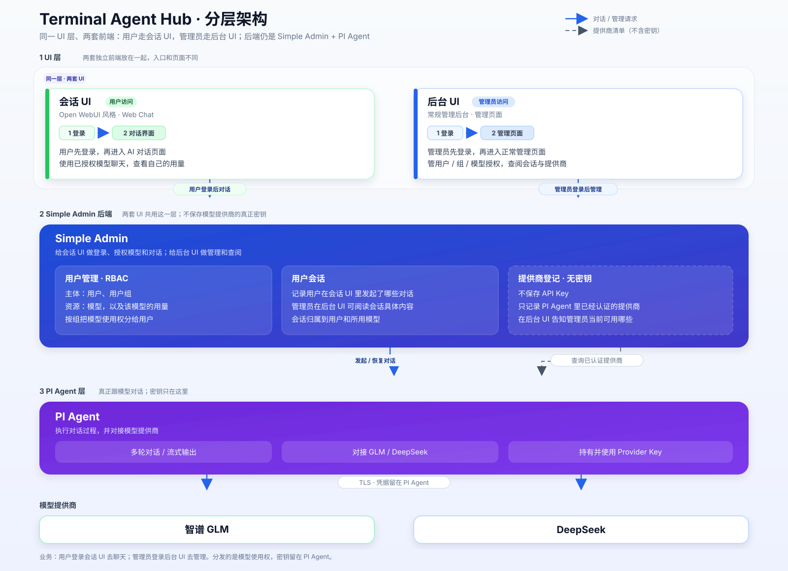

# Terminal Agent Hub 系统需求文档

> 文档版本：v0.2（按 Go 直连 Pi 方案重写）  
> 更新日期：2026-09-01  
> 产品定位：面向组织的多用户 Agent、模型与工具能力分发平台  
> 配套架构图：[static-architecture.svg](./static-architecture.svg)



---

## 1. 文档目的

本文定义 Terminal Agent Hub V1 的市场需求、功能范围、技术规格、静态架构、扩展边界与验收标准，作为产品、设计、开发、测试及部署的共同依据。

本版架构基于以下已确认结论：

1. Go 控制面通过 Pi 官方 JSONL RPC 直接管理 Pi Agent；
2. V1 不引入 Python Agent 服务；
3. Pi 负责模型调用、Agent Loop、会话、工具与流式事件；
4. Simple Admin/Go 负责多用户身份、RBAC、模型和 Agent 分发、运行时治理、审计及配额；
5. V1 不自建 RAG；未来优先适配 Dify、RAGFlow、FastGPT 或其他外部 RAG 服务；
6. 外部 RAG/MCP/工具以受控连接器或 Pi Extension 的形式接入，不成为核心系统强依赖。

## 2. 背景与产品定义

组织采购 GLM、DeepSeek 等模型后，通常面临以下问题：

- Provider API Key 不适合直接发给每个用户；
- 不同用户组应获得不同模型、Agent 与工具权限；
- Web Chat、管理后台与终端 Agent 的身份、权限和审计割裂；
- 终端 Agent 通常要求用户自行安装、配置密钥，缺少组织级吊销和配额；
- 第三方工具、MCP 或 RAG 平台需要统一接入、授权、停用和审计。

Terminal Agent Hub 将 Pi 从“个人终端工具”托管为组织级 Agent Runtime，由 Go 控制面向 Web 和终端用户分发其使用权。

**“分发”指分发模型、Agent、工具和连接器的使用权，而不是分发 Provider 密钥。**

## 3. 角色与核心术语

| 名词 | 定义 |
|---|---|
| 超级管理员 | 管理系统初始化、管理员、Secret 配置与全局安全策略。 |
| 管理员 | 管理用户、用户组、Provider、Model、Agent、Extension、Connector、授权、配额和审计。 |
| 普通用户 | 通过 Web 或 CLI/TUI 使用被授权模型、Agent 和工具的用户。 |
| 用户组 | RBAC 的主要授权主体，例如研发组、运营组；一个用户可属于多个组。 |
| Provider | 模型提供商实例；V1 为智谱 GLM 和 DeepSeek。 |
| Model | Provider 下可被 Pi 调用的模型条目。 |
| Agent | 基础模型、系统提示词、Skills、Extensions、工具白名单和运行策略的组合。 |
| Tool | 可由模型调用的能力，包括 Pi 内置工具、自定义工具或由 MCP 映射出的工具。 |
| Extension | 使用 TypeScript 编写的 Pi 扩展，可注册工具、命令、事件钩子和 Provider。 |
| Connector | 对外部 MCP、RAG 或 HTTP/CLI 服务的受控连接配置。 |
| Pi Runtime | 执行 Agent Session、模型调用和 Tool Loop 的 Node.js/TypeScript 进程。 |
| Runtime Manager | Go 后端中负责启动、恢复、中止、观察和回收 Pi 进程的模块。 |
| Pi Session | Pi 以 JSONL 保存的会话树，支持消息、工具结果、分支、压缩及用量。 |

### 3.1 “Go CTL”调研结论

`goctl` 是 go-zero 的代码生成 CLI，可生成 HTTP、gRPC、数据库 Model、Dockerfile 与 Kubernetes 脚手架，不是 Admin UI。[S3]

V1 推荐组合为：

- **管理脚手架**：Simple Admin；
- **后端框架**：go-zero；
- **代码生成**：goctl；
- **后台前端**：Vben Admin/Vue 3；
- **资源授权**：Simple Admin/Casbin 路由权限 + 自研资源 Grant。

Simple Admin 已具备用户、角色、权限、菜单、日志、配置等基础能力，并支持 MySQL 与 Redis 配置，可减少通用后台重复开发。[S1][S2]

### 3.2 Pi 能力边界

Pi 已提供：

- 模型流式输出；
- `text_delta`、`thinking_delta`、Tool Call 和 Tool Execution 等事件；
- JSONL RPC 模式；
- Agent Session、恢复、分支、压缩和 Usage；
- Skills、Extensions、Pi Packages；
- `pi.registerTool()` 自定义工具；
- Provider 与自定义 OpenAI 兼容模型配置。[S9][S10][S11]

Pi 不提供：

- 平台用户和用户组；
- 多租户/RBAC；
- 会话所有权；
- 组织级模型、Extension、MCP 和 RAG 授权；
- HTTP REST/SSE 管理服务；
- 内置 MCP Client。

以上平台能力由 Go 控制面补充。Pi RPC 保持服务端内部协议，不直接暴露给浏览器或普通终端。

---

## 4. 市场需求分析

### 4.1 按模块分析

| 模块 | 用户与市场需求 | 开源参考 | 市场缺口 | V1 策略 | 优先级 |
|---|---|---|---|---|---|
| 用户对话前台 | 普通用户需要低门槛多轮对话、流式回复和历史会话。 | Open WebUI 提供自托管、多模型、RBAC 与模型级访问控制实践。[S4][S5] | 通用聊天 UI 与组织终端 Agent、统一 Tool 权限往往割裂。 | 自研轻量 Open WebUI 风格前台，只展示有效授权资源。 | P0 |
| 后台管理前端 | 管理员需要管理用户、组、模型、Agent、工具与权限，并预览最终授权。 | Simple Admin 提供 Vben Admin 和 RBAC 基础。[S1] | 通用 Admin 缺少 Agent、模型、Tool、Connector 等领域对象。 | 在 Simple Admin 上扩展 Agent Hub 业务菜单。 | P0 |
| Go 控制面 | 组织需要唯一身份与授权事实源，且 Provider 密钥不下发。 | go-zero/goctl 与 Simple Admin。[S1][S3] | Pi 本身不是多用户管理平台。 | Go 管 RBAC、资源目录、会话归属、Runtime、配额和审计。 | P0 |
| Pi Runtime | 用户需要模型流式对话、Agent Loop、Tools、Skills 与可恢复会话。 | Pi SDK/RPC/Extension/Session。[S9][S10][S11] | Pi 默认是个人终端 Agent，没有平台多用户治理。 | Go 通过 RPC 托管隔离的 Pi Runtime，Pi 专注执行。 | P0 |
| 终端客户端 | 开发者希望登录后直接使用组织授权 Agent，无需保存 Provider Key。 | Pi TUI 及 RPC 事件模型。 | 个人 Agent 的密钥、权限和审计难以集中管理。 | 提供薄 CLI/TUI，调用 Go API/SSE，不直接连接 Provider。 | P0 |
| 模型提供商 | 管理员需要统一接入 GLM、DeepSeek，支持启停、轮换和用量追踪。 | 两家均提供服务端 API/OpenAI 兼容调用。[S7][S8] | API 兼容不代表 Tool/推理/Usage 完全一致。 | 由 Pi Provider 配置接入，Go 管 Provider/Model 目录和凭据引用。 | P0 |
| Extension/Tool | 管理员需要按 Agent、用户组分发可信工具。 | Pi Extension 可注册工具、拦截调用、动态启停工具。[S11] | 任意扩展拥有高系统权限，普通用户自行安装风险高。 | 扩展由管理员审核发布，运行时使用严格工具白名单。 | P1 |
| 外部 RAG/MCP | 后续可能需要企业知识库或其他工具，但不希望自建完整 RAG。 | Dify、RAGFlow、FastGPT 均提供知识检索/API；MCP 标准提供工具发现与调用。[S12][S13][S14][S15] | 外部框架协议、结果和授权方式不同。 | 保留 Connector SPI；后续按需适配，不纳入 V1 强依赖。 | P2 |

### 4.2 目标市场与差异化

| 维度 | 定义 |
|---|---|
| 初始客户 | 10～500 人的研发团队、AI 平台团队、教育/培训团队及统一采购模型的组织。 |
| 购买者 | IT 管理员、研发负责人、AI 平台负责人。 |
| 使用者 | Web Chat 业务用户及终端 Agent 开发者。 |
| 核心价值 | 一次接入模型，按组分发模型、Agent 和工具；密钥集中；Web/终端统一身份和审计。 |
| 差异化 | Simple Admin RBAC + Pi Agent Runtime + Web/终端双入口 + 可治理的扩展连接器。 |
| 架构原则 | 核心保持精简；非核心能力优先通过 Pi Package、Extension、MCP 或外部服务扩展。 |

### 4.3 V1 成功指标

| 指标 | 目标 |
|---|---|
| 初次部署 | Docker Compose 文档化环境 30 分钟内启动并可登录。 |
| 授权效率 | 管理员在 5 分钟内完成“建组→模型→Agent→授权”。 |
| 权限生效 | 一般授权变更 60 秒内生效；用户/模型/Agent 禁用立即阻止新请求。 |
| 平台附加延迟 | 不计上游模型，首事件附加延迟 P95 小于 300 ms。 |
| 密钥安全 | 浏览器、CLI、普通日志、Session JSONL 中不出现 Provider Key。 |
| 可审计性 | 每次模型和工具调用可追溯用户、Agent、模型、授权来源、时间和结果。 |

---

## 5. 权限模型

### 5.1 资源授权规则

1. 授权主体支持用户组和单个用户；推荐以组为主；
2. V1 采用加法式授权：用户有效权限为角色、所属组与直接授权的并集；
3. 资源类型至少包括 `model`、`agent`、`tool`、`connector`；
4. Agent 的有效使用权要求用户同时拥有 Agent 及其基础模型权限；
5. Tool 的有效使用权为：

```text
平台启用 Tool
∩ Agent Tool 白名单
∩ 用户/组 Tool 授权
∩ Runtime 安全策略
```

6. Connector/RAG 的有效使用权要求用户拥有 Connector 及目标外部资源映射权限；
7. 用户、Provider、Model、Agent、Tool 或 Connector 任一禁用，新请求必须拒绝；
8. UI 隐藏不是授权，Go API 在列资源与执行时都必须鉴权；
9. V1 不实现显式 Deny；未来引入时 Deny 应高于 Allow。

### 5.2 角色能力

| 角色 | 能力 |
|---|---|
| 超级管理员 | 全部权限、Secret 管理、系统初始化和可信扩展发布。 |
| 管理员 | 用户/组、模型、Agent、工具、Connector、授权、审计和用量管理；不能读取密钥明文。 |
| 普通用户 | 使用获授权资源、管理自己的会话。 |
| 禁用/待审核用户 | 不得登录或发起新执行。 |

---

## 6. V1 范围

### 6.1 范围内

- 本地账号密码登录、JWT、用户启停；
- 用户、用户组及组成员管理；
- GLM、DeepSeek Provider 与 Model 管理；
- Agent 配置与按组/用户授权；
- Open WebUI 风格 Web Chat；
- Pi 流式事件转 SSE；
- 多轮会话、新建、恢复、重命名、删除和中止；
- Go Runtime Manager 直接管理 Pi RPC 进程；
- CLI/TUI 登录、资源列表、会话、恢复和中止；
- 调用用量、管理操作和工具调用审计；
- Docker Compose 单机交付；
- 为 Extension、MCP 和第三方 RAG 保留领域模型及接口边界，但不要求 V1 完成 RAG 集成。

### 6.2 V1 不包含

- Python Agent 服务；
- 自建 RAG 的文档解析、切片、Embedding、向量库、检索和 Rerank；
- Dify/RAGFlow/FastGPT 的正式连接器实现；
- 内置 MCP Client；
- 用户自行安装 Extension/Pi Package/MCP Server；
- 企业 OIDC/LDAP/SCIM；
- 多租户商业计费；
- 自动跨 Provider 降级；
- Kubernetes 多节点 Runtime 调度；
- 将服务端 Pi Runtime 下发至用户本机运行。

---

## 7. 功能需求

### 7.1 用户对话前台

| ID | 需求点 | 技术规格 | 实现简述 | 验收标准 | 优先级 |
|---|---|---|---|---|---|
| FE-01 | 登录 | HTTPS；短期 Access Token + 可轮换 Refresh Token。 | 调用 Go Auth API；Web 优先 HttpOnly/Secure Cookie。 | 禁用/待审核用户不可登录。 | P0 |
| FE-02 | 可用资源 | 仅展示用户有效 Model/Agent。 | Go 计算组授权、直接授权和资源状态。 | 未授权资源不可见，直接构造 ID 返回 403。 | P0 |
| FE-03 | 多轮会话 | 会话绑定 owner、Agent/Model、Pi Session。 | Go 创建会话映射并启动/恢复 Pi Session。 | 刷新后可恢复活动分支消息。 | P0 |
| FE-04 | 流式输出 | SSE 支持文本、思考状态、工具状态、Usage、Done/Error。 | Go 将 Pi RPC 事件转换为稳定 SSE 协议。 | 增量顺序正确；一次流只出现一个终止事件。 | P0 |
| FE-05 | 消息展示 | Markdown、安全代码高亮、复制、停止、重新生成。 | 前端安全渲染；停止映射 Pi `abort`。 | 不执行消息中的脚本；停止后不再追加输出。 | P0 |
| FE-06 | 会话管理 | 列表、搜索、重命名、删除；仅本人访问。 | MySQL 保存会话索引和归属；Pi JSONL 保存执行历史。 | 跨用户读取返回 404/403。 | P0 |
| FE-07 | 工具状态 | 展示允许公开的工具名称、状态和脱敏结果摘要。 | Go 过滤 Pi Tool 事件，隐藏敏感参数/结果。 | 不泄露路径、密钥和内部堆栈。 | P1 |

### 7.2 后台管理

| ID | 需求点 | 技术规格 | 实现简述 | 验收标准 | 优先级 |
|---|---|---|---|---|---|
| AD-01 | 用户管理 | 创建、编辑、禁用、重置密码。 | 扩展 Simple Admin 用户模块。 | 禁用后无法刷新 Token 或执行新请求。 | P0 |
| AD-02 | 用户组 | 组 CRUD、成员批量加入/移除；一人多组。 | `groups`、`user_groups` 多对多。 | 组变更在 60 秒内反映到资源列表。 | P0 |
| AD-03 | Provider | GLM/DeepSeek 类型、Base URL、Secret 引用、超时、启停。 | 密钥写 Secret Store/密文，读取接口只返回掩码。 | 密钥不返回前端；连通性测试通过。 | P0 |
| AD-04 | Model | 上游 ID、展示名、上下文、能力、启停。 | Provider 与 Model 一对多。 | 停用后新请求立即拒绝。 | P0 |
| AD-05 | Agent | 基础模型、系统提示词、Skills、Extension、工具白名单、运行参数。 | 保存声明式 AgentSpec，由 Runtime Manager 生成 Pi 配置。 | 用户只能使用已授权且配置有效的 Agent。 | P0 |
| AD-06 | 资源授权 | 对 Model/Agent/Tool/Connector 按组或用户授权；权限预览。 | 统一 `resource_grants` 表。 | 预览结果与实际执行权限一致。 | P0 |
| AD-07 | Runtime 管理 | 查看活动数、用户、会话、启动时间、状态；支持强制中止。 | Runtime Manager 暴露只读状态和管理操作。 | 中止后进程及租约在超时内释放。 | P0 |
| AD-08 | Extension/Tool 目录 | 登记可信包、版本、校验和、工具列表、状态。 | 仅管理员发布；镜像或可信包仓固定版本。 | 普通用户不能上传或启用任意代码。 | P1 |
| AD-09 | Connector 目录 | 预留 HTTP、MCP、RAG 类型、Endpoint、Secret、能力、状态。 | Connector 配置版本化，不在 V1 强制执行。 | 数据模型和 API 可创建禁用的占位 Connector。 | P2 |
| AD-10 | 配额审计 | 请求、并发、Token；登录、授权、模型与工具调用日志。 | Redis 限流/租约，MySQL 记录用量和审计。 | 可按用户、模型、Agent、Tool、时间查询。 | P0 |

### 7.3 Go 控制面与 Runtime Manager

| ID | 需求点 | 技术规格 | 实现简述 | 验收标准 | 优先级 |
|---|---|---|---|---|---|
| GO-01 | 统一 API | REST/JSON `/api/v1`；OpenAPI；SSE。 | go-zero API + goctl 骨架。 | 契约测试覆盖 API 与 SSE。 | P0 |
| GO-02 | 双层鉴权 | 管理路由权限 + Model/Agent/Tool 资源权限。 | Casbin 管路由，Resource Grant 管业务资源。 | 越权请求全部拒绝。 | P0 |
| GO-03 | Pi 进程管理 | `os/exec`、stdin/stdout pipe、严格 LF JSONL；超时/中止/回收。 | 独立 Runtime Manager，不在 HTTP Handler 中散落进程逻辑。 | 异常退出、超时和取消无僵尸进程。 | P0 |
| GO-04 | RPC 客户端 | 支持 prompt、abort、new/switch session、state、messages、usage。 | 请求 ID 关联 response；事件异步分发。 | 并发命令和事件不串会话。 | P0 |
| GO-05 | SSE 转换 | 将 Pi `message_update`、tool、retry、compaction、settled 转内部协议。 | 每条流设置 request_id、conversation_id。 | `done/error` 互斥且唯一。 | P0 |
| GO-06 | 会话归属 | MySQL 映射平台会话与 Pi session ID/file；路径不含用户名。 | 每次恢复前检查 owner 与资源权限。 | A 用户无法打开 B 用户 session。 | P0 |
| GO-07 | Runtime 配置 | 独立 cwd、session dir、`PI_CODING_AGENT_DIR`、模型范围、工具范围。 | 从 AgentSpec 生成短期运行配置；密钥通过环境引用。 | Session JSONL 和启动参数中无 Provider Key。 | P0 |
| GO-08 | 进程并发策略 | V1 每活动会话一个 Runtime 或受控 Worker；Redis 租约。 | 进程空闲关闭；Session 保留后可恢复。 | 并发上限可配置，超额返回 429。 | P0 |
| GO-09 | 日志与追踪 | request_id/trace_id/user_id/conversation_id/pi_session_id。 | 结构化日志，敏感字段脱敏。 | 一次调用可串联 Go、Pi 和 Provider。 | P0 |
| GO-10 | 大行读取 | 不使用默认 64 KB 限制的 Scanner，或显式扩大 Buffer。 | 使用 LF Reader/自定义 decoder，限制总消息大小。 | 大 Tool Result JSONL 不导致 Runtime 客户端崩溃。 | P0 |

### 7.4 Pi Runtime

| ID | 需求点 | 技术规格 | 实现简述 | 验收标准 | 优先级 |
|---|---|---|---|---|---|
| PI-01 | RPC 模式 | `pi --mode rpc`；stdin/stdout JSONL。 | Go 启动并完成状态探测。 | prompt 后收到 response、流事件和 settled。 | P0 |
| PI-02 | 模型调用 | GLM 通过 OpenAI 兼容自定义 Provider；DeepSeek 使用内置/兼容 Provider。 | Runtime 使用服务端生成的模型配置和环境密钥。 | 两家普通流、错误、超时契约测试通过。 | P0 |
| PI-03 | Session | 持久 JSONL、恢复、分支、压缩和 Usage。 | 每个会话独立 session dir；Go 保存映射。 | 重启 Runtime 后可恢复上下文。 | P0 |
| PI-04 | 流式事件 | 文本、Thinking、Tool Call、Tool Result、Usage、Settled。 | Go 订阅并转换。 | 流事件顺序和归属正确。 | P0 |
| PI-05 | 工具白名单 | 使用 `--tools`、`--exclude-tools`、`--no-builtin-tools` 或 Active Tools。 | AgentSpec 决定最终工具集合。 | Prompt 无法启用未授权工具。 | P0 |
| PI-06 | Extension | 只加载管理员批准、固定版本、校验通过的 Extension/Pi Package。 | 项目级动态资源默认不信任；运行镜像固定可信扩展。 | 未批准扩展不会加载。 | P1 |
| PI-07 | 沙箱 | 高风险 read/write/bash 工具在容器/受限目录运行。 | 最小文件权限、网络策略、CPU/内存/时长限制。 | Runtime 无法读取其他用户目录或平台 Secret。 | P0 |
| PI-08 | 扩展状态 | Extension 状态使用 Pi Session Entry/Tool Result 保存。 | 状态随 Session 恢复，不写共享全局可变文件。 | 会话间扩展状态不串线。 | P1 |

### 7.5 终端客户端

| ID | 需求点 | 技术规格 | 实现简述 | 验收标准 | 优先级 |
|---|---|---|---|---|---|
| CLI-01 | 登录 | 浏览器/设备码优先，密码备选；只保存平台 Token。 | 调用 Go Auth API。 | 本地不保存 Provider Key。 | P0 |
| CLI-02 | 资源列表 | 展示有效 Agent/Model。 | 调用 `/me/resources`。 | 与 Web 有效资源一致。 | P0 |
| CLI-03 | 流式会话 | 文本、工具状态、Ctrl+C 中止。 | 消费 Go SSE/WebSocket，不直接连 Pi RPC。 | 中止后 Runtime 被通知且资源释放。 | P0 |
| CLI-04 | 会话恢复 | 列表、恢复自己的平台会话。 | Go 查 owner 并恢复 Pi session。 | 网络/进程重启后可恢复持久消息。 | P0 |
| CLI-05 | 本地文件边界 | V1 不静默上传用户本机目录。 | 文件上下文必须由用户显式选择。 | 未选择文件时无本地内容上传。 | P0 |

### 7.6 模型提供商

| ID | 需求点 | 技术规格 | 实现简述 | 验收标准 | 优先级 |
|---|---|---|---|---|---|
| MP-01 | GLM | Base URL、API Key、模型 ID；OpenAI 兼容配置。 | Go 生成 Pi Provider/Model 配置。[S7] | 普通流、401、429、5xx、超时测试通过。 | P0 |
| MP-02 | DeepSeek | OpenAI 兼容 API、模型 ID、Tool/Thinking 能力声明。 | Pi 内置或自定义 Provider 配置。[S8] | 与 GLM 核心契约一致。 | P0 |
| MP-03 | 密钥管理 | Secret 引用、版本、轮换、掩码展示。 | 密钥只进入 Pi 进程环境/内存。 | 前端、日志、session 无明文。 | P0 |
| MP-04 | 模型能力 | reasoning、tool、vision、context、max output。 | Model 目录保存能力标签，启动前校验 AgentSpec。 | 不兼容 Agent 配置不可启动。 | P1 |
| MP-05 | 健康状态 | 连通性、认证、429/5xx、延迟。 | 管理员测试 + 运行指标。 | 故障返回稳定业务错误，不泄露上游敏感信息。 | P1 |

---

## 8. 外部 RAG、MCP 与工具扩展敞口

### 8.1 设计目标

V1 不建设知识库基础设施，但必须避免未来接入外部 RAG 时改造核心会话与权限模型。

目标是让外部能力满足：

```text
注册 Connector
→ 管理员配置 Endpoint/Secret
→ 绑定 Agent
→ 按用户组授权
→ Pi 以 Tool 调用
→ 结果归一并进入上下文
→ 平台记录审计
```

### 8.2 支持的扩展形态

| 形态 | 调用链 | 适用场景 | 是否需要 Python |
|---|---|---|---|
| Pi 原生 Extension | Pi `registerTool` → 外部 HTTP/CLI | 自有 API、逻辑简单、性能要求明确。 | 否 |
| Go Connector API | Pi Extension → Go → 外部 RAG | 需要集中 RBAC、密钥、审计与协议归一。 | 否 |
| MCP Client Extension | Pi → MCP Client Extension → MCP Server | 外部能力已提供 MCP，或希望标准化工具发现。 | 否 |
| 外部 RAG HTTP Adapter | Pi/Go → Dify/RAGFlow/FastGPT API | 使用成熟第三方知识库和检索能力。 | 否 |
| Python 专用适配器 | Go/Pi → 独立 Python 服务 | 仅当依赖 Python 独有解析/ML 库时按需加入。 | 可选，非核心 |

### 8.3 RAG Connector 能力类型

未来 Connector 应显式声明能力，避免把“检索”和“完整外部 Agent”混为一谈：

| 能力 | 说明 |
|---|---|
| `retrieval` | 输入 query 和检索参数，返回文本片段、分数、标题、来源及 metadata；由 Pi 完成最终生成。 |
| `chat_app` | 调用外部 RAG 应用并获得完整答案；平台只代理和审计，模型/Tool Loop 可能由外部平台控制。 |
| `mcp_tools` | 通过 MCP `tools/list` 与 `tools/call` 暴露一个或多个工具。 |
| `http_tool` | 固定 HTTP API 映射为单个 Pi Tool。 |
| `cli_tool` | 受控 CLI 映射为 Pi Tool，仅在沙箱内运行。 |

V1 后续优先实现 `retrieval`，因为它保留 Pi 对最终模型、会话和生成过程的控制。

### 8.4 推荐的统一检索协议

内部标准请求：

```json
{
  "connector_id": "rag-1",
  "source_id": "kb-123",
  "query": "用户问题",
  "top_k": 5,
  "score_threshold": 0.3,
  "filters": {},
  "request_id": "req-..."
}
```

内部标准结果：

```json
{
  "records": [
    {
      "content": "检索片段",
      "score": 0.91,
      "title": "文档标题",
      "source_uri": "external://document/123",
      "metadata": {}
    }
  ]
}
```

Dify 已定义包含 `knowledge_id`、`query`、`top_k`、`score_threshold` 与 `records` 的外部知识检索契约；RAGFlow 提供 HTTP API 和检索能力；FastGPT 提供知识库搜索 API。因此以上内部协议可作为多个框架的最小公共模型。[S12][S13][S14]

### 8.5 RAG/Connector 权限要求

1. 外部 API Key 只保存在 Secret Store，不进入模型上下文；
2. 模型生成的 `source_id` 不可信，最终 source 范围必须来自 Go 下发的授权配置；
3. Connector 请求携带平台生成的短期身份/作用域，不能让模型自报 user_id；
4. 返回内容按大小和 Token 上限截断；完整结果不得无界写入上下文；
5. 记录 connector_id、source_id、query 摘要、结果数量、耗时和状态；
6. 外部内容视为不可信输入，不能覆盖平台 RBAC 或工具策略；
7. MCP Server 的 Tool 注释和 Schema 同样视为不可信，需管理员审核并设置允许范围；
8. 普通用户不可填写任意外部 Endpoint，防止 SSRF 和数据外传。

### 8.6 Pi MCP 扩展说明

Pi 核心不内置 MCP Client。接入 MCP 必须：

1. 安装可信的第三方 Pi MCP Extension；或
2. 自研 MCP Client Extension，将 `tools/list` 映射为 `pi.registerTool()`，将调用映射为 `tools/call`。

MCP 标准允许 Server 暴露工具名称、描述、输入 Schema 和结构化/非结构化结果，但客户端仍需自行完成信任、授权、结果校验及 UI 行为。[S15]

### 8.7 Extension 安全

Pi Extension 以运行进程权限执行任意代码。平台必须：

- 只从管理员配置的可信仓库安装；
- 固定版本/commit 和完整性校验；
- 在构建或发布阶段审核依赖；
- 禁止普通用户安装任意包；
- 在容器或沙箱运行高风险工具；
- 使用 AgentSpec 和 RBAC 决定 Active Tools；
- 记录 Tool Call 与结果摘要；
- 限制网络出口、文件路径、CPU、内存和执行时间。

---

## 9. 技术规格

### 9.1 推荐技术栈

| 层 | 技术规格 | 理由 |
|---|---|---|
| Web Admin/Chat | Vue 3、TypeScript、Vite、Vben Admin | 复用 Simple Admin 生态并共享认证/API SDK。 |
| Go 控制面 | Go、go-zero、goctl、Simple Admin、Casbin、Ent | 管理、RBAC、API、Runtime 编排集中在一种后端语言。 |
| Pi Runtime | `@earendil-works/pi-coding-agent`、Node.js/TypeScript、JSONL RPC | 原生 Agent、Session、Streaming、Tools 与 Extensions。 |
| 终端 | Go 单二进制或 Node/Python 薄 CLI；只调用平台 API | 客户端语言不影响核心架构。 |
| 数据库 | MySQL 8.0+、utf8mb4、InnoDB | 平台主数据、会话索引、用量和审计。 |
| 缓存 | Redis 7+ | RBAC 缓存、限流、Runtime 租约和短期状态。 |
| 网关 | Nginx/Caddy、TLS、SSE 代理 | 统一入口和流式代理。 |
| 交付 | Docker Compose、固定镜像版本、迁移 | V1 快速部署。 |
| 可观测性 | OpenTelemetry、Prometheus、JSON 日志 | 串联 Go、Pi 和 Provider。 |
| 外部扩展 | Pi Extension、Pi Package、MCP Client Extension、HTTP Adapter | RAG/工具按需接入，不污染核心。 |

### 9.2 建议仓库结构

```text
terminal-agent-hub/
├── apps/
│   ├── web-admin/
│   ├── web-chat/
│   ├── control-plane/          # Go API、领域逻辑、Runtime Manager
│   └── terminal-cli/
├── runtime/
│   ├── trusted-extensions/     # 审核并锁定版本的 Pi 扩展
│   ├── skills/
│   └── image/                  # Pi Runtime 镜像
├── connectors/
│   ├── contracts/              # Connector/RAG/MCP 内部契约
│   └── examples/               # 后续适配器，不是 V1 强依赖
├── packages/
│   ├── api-contracts/
│   └── ui/
├── deploy/
│   ├── compose/
│   └── migrations/
└── docs/
```

### 9.3 Runtime Manager 接口建议

```go
type RuntimeManager interface {
    Start(ctx context.Context, spec RuntimeSpec) (RuntimeID, error)
    Resume(ctx context.Context, sessionRef SessionRef, spec RuntimeSpec) (RuntimeID, error)
    Prompt(ctx context.Context, id RuntimeID, command PromptCommand) (<-chan Event, error)
    Abort(ctx context.Context, id RuntimeID) error
    State(ctx context.Context, id RuntimeID) (RuntimeState, error)
    Close(ctx context.Context, id RuntimeID) error
}
```

模块内部负责：

- 命令/响应 ID 关联；
- LF JSONL 编解码；
- stdout 事件广播；
- stderr 日志脱敏；
- 进程树终止；
- 并发租约；
- Session 目录；
- SSE 事件转换；
- 空闲回收和恢复。

### 9.4 主要数据实体

| 实体 | 关键字段/关系 | 说明 |
|---|---|---|
| users | id, username, password_hash, status, role | 平台身份。 |
| groups | id, name, status | 用户组。 |
| user_groups | user_id, group_id | 用户组成员关系。 |
| providers | id, type, base_url, secret_ref, status, config_version | GLM/DeepSeek 实例。 |
| models | id, provider_id, upstream_id, capabilities, status | 模型目录。 |
| agents | id, base_model_id, system_prompt, runtime_policy, status | Agent 主配置。 |
| agent_resources | agent_id, resource_type, resource_id, config | Agent 绑定 Skill/Extension/Tool/Connector。 |
| resources | id, type, name, version, status, metadata | Tool/Extension/Connector 统一目录或视图。 |
| resource_grants | resource_type, resource_id, principal_type, principal_id, permission | 用户/组资源授权。 |
| conversations | id, owner_id, agent_id, model_id, title, status | 平台会话索引。 |
| pi_sessions | conversation_id, pi_session_id, session_ref, leaf_id, state | Pi Session 映射。 |
| runtime_instances | id, conversation_id, node_id, pid_ref, lease, state | 活动 Runtime 状态。 |
| connector_configs | id, type, endpoint, secret_ref, capabilities, status | 后续外部连接器。 |
| external_resources | connector_id, external_id, type, metadata, status | 外部知识库/应用映射。 |
| usage_records | request_id, user_id, model_id, tokens, latency, status | 模型用量。 |
| tool_audits | request_id, tool_id, connector_id, args_redacted, status, latency | 工具/Connector 审计。 |
| audit_events | actor_id, action, target, trace_id, metadata_redacted | 管理审计。 |

### 9.5 API 草案

| 方法与路径 | 用途 |
|---|---|
| `POST /api/v1/auth/login` | 登录。 |
| `POST /api/v1/auth/refresh` | Token 轮换。 |
| `GET /api/v1/me/resources` | 有效 Model/Agent/Tool。 |
| `POST /api/v1/conversations` | 创建会话。 |
| `GET /api/v1/conversations` | 查询自己的会话。 |
| `GET /api/v1/conversations/{id}/messages` | 查询过滤后的 Pi Session 消息。 |
| `POST /api/v1/conversations/{id}/messages` | 发消息并返回 SSE。 |
| `POST /api/v1/requests/{id}/cancel` | 中止 Pi 执行。 |
| `/api/v1/admin/users/*` | 用户管理。 |
| `/api/v1/admin/groups/*` | 用户组管理。 |
| `/api/v1/admin/providers/*` | Provider 管理。 |
| `/api/v1/admin/models/*` | Model 管理。 |
| `/api/v1/admin/agents/*` | Agent 管理。 |
| `/api/v1/admin/resources/*` | Extension/Tool/Connector 目录。 |
| `/api/v1/admin/grants/*` | 授权和权限预览。 |
| `/api/v1/admin/runtimes/*` | Runtime 观察和中止。 |
| `/api/v1/admin/audits/*` | 审计和用量。 |

### 9.6 SSE 事件草案

```text
event: text_delta
data: {"request_id":"...","delta":"你好"}

event: tool_start
data: {"request_id":"...","tool_call_id":"...","name":"search_knowledge"}

event: tool_end
data: {"request_id":"...","tool_call_id":"...","is_error":false}

event: usage
data: {"input_tokens":100,"output_tokens":20}

event: done
data: {"finish_reason":"stop"}
```

要求：

- 所有事件含 `request_id`；
- Tool 参数和结果按展示策略脱敏；
- `done` 与 `error` 互斥且只出现一次；
- 以 Pi `message_end` 为消息最终状态，以 `agent_settled` 为运行完全结束状态。

---

## 10. 静态架构说明

### 10.1 核心调用链

#### Web/终端对话

1. 用户登录 Go 控制面；
2. Go 返回有效 Model/Agent；
3. 用户创建或恢复平台会话；
4. Go 检查用户、组、Agent、Model、Tool、配额和会话所有权；
5. Runtime Manager 从 AgentSpec 生成隔离配置；
6. Go 启动或恢复 `pi --mode rpc`；
7. Go 向 Pi 发送 prompt；
8. Pi 调用 GLM/DeepSeek，并按白名单调用工具；
9. Go 将 Pi JSONL 事件转换为 SSE；
10. Go 保存会话索引、用量和审计，Pi JSONL 保存执行历史。

#### 后续外部 RAG

1. 管理员注册并测试 RAG Connector；
2. 管理员映射外部知识库并绑定 Agent；
3. Go 只向 Runtime 下发用户获授权的 Connector/source；
4. Pi Extension 将 `search_knowledge` 注册为 Tool；
5. Pi Tool 通过 Go Adapter、HTTP 或 MCP 调用外部 RAG；
6. 检索片段归一、截断后作为 Tool Result 返回 Pi；
7. Pi 使用被检索内容生成答案；
8. Go 记录 Connector 和来源审计。

### 10.2 组件职责

| 组件 | 负责 | 不负责 |
|---|---|---|
| Web Admin | 管理操作、权限预览、审计查询。 | 不调用 Provider，不持有密钥。 |
| Web Chat | 对话和历史展示。 | 不作为最终授权判断方。 |
| CLI/TUI | 平台登录和流式交互。 | 不直连 Pi RPC/Provider。 |
| Go 控制面 | 身份、RBAC、目录、会话归属、Runtime、SSE、配额、审计。 | 不实现模型 Agent Loop，不自建 RAG。 |
| Pi Runtime | 模型、Session、Agent Loop、Skills、Extensions、Tools。 | 不管理平台用户/组/RBAC。 |
| MySQL | 业务主数据、会话索引、用量和审计。 | 不保存可读取的密钥明文。 |
| Redis | 缓存、限流、租约和活动状态。 | 不作为最终权限事实源。 |
| 外部 RAG/MCP | 检索、知识库或外部工具。 | 不决定平台用户授权。 |

### 10.3 存储策略

- Pi Session JSONL 是 Agent 执行历史和恢复上下文的事实源；
- MySQL 保存平台会话归属、标题、索引、Pi Session 引用、用量与审计；
- Web 历史消息由 Go 读取/转换 Pi Session，并过滤不应展示的内部内容；
- V1 单机使用持久卷；未来多节点需对象存储/共享存储或 Session 节点亲和；
- 删除平台会话必须同步删除或进入延迟清理的 Pi Session 文件。

---

## 11. 非功能需求

| 类别 | 需求 | V1 验收口径 |
|---|---|---|
| 安全 | 密钥集中、日志脱敏、最小权限、可信扩展。 | 前端、CLI、日志、Session 无 Provider/Connector Key。 |
| 权限一致性 | UI、API、Runtime 工具集合一致。 | 构造未授权 model/agent/tool 请求均被拒绝。 |
| 进程隔离 | 用户 cwd、session、env 和进程隔离。 | A 用户不能读取 B 用户文件、Session 或工具结果。 |
| 性能 | Go 不显著增加首事件延迟。 | 不计 Provider，附加 P95 < 300 ms。 |
| 并发 | V1 单实例至少支持 100 条并发流，硬件规格随压测记录。 | 无串流、僵尸进程或持续内存泄漏。 |
| 可靠性 | 超时、中止、429/5xx、断流可控。 | 资源最终释放；错误码稳定；消息不重复写入。 |
| 可观测性 | 全链路 trace 和 Runtime 指标。 | 可由 request_id 定位 Go、Pi、Provider/Connector。 |
| 可维护性 | Runtime Manager 与 Connector SPI 为深模块。 | Handler 不直接操作 pipes；新 Connector 不改核心会话流程。 |
| 可扩展性 | Tool/Connector 能力声明和统一授权。 | 新 HTTP Retrieval Connector 只需 Adapter、配置与契约测试。 |
| 可部署性 | Docker Compose 一键启动。 | 空环境启动 Web、Go、Pi、MySQL、Redis。 |
| 隐私 | 默认不记录完整思考链、Secret 或敏感 Tool Result。 | 日志抽查和自动 Secret 扫描零发现。 |

---

## 12. 安全重点

1. Provider/Connector Secret 优先使用 Vault、云 Secret Manager 或 KMS；
2. Pi Runtime 使用独立、最小化环境，不继承 Go 进程的所有 Secret；
3. Extension/Pi Package 运行任意代码，必须管理员审核和版本锁定；
4. `bash/write/edit` 默认不对所有 Agent 开放；
5. MCP/RAG Endpoint 由管理员配置并限制内网/出口，防止 SSRF；
6. Tool 参数必须重新校验，不能信任模型生成的路径、用户 ID、知识库 ID；
7. Runtime 必须设置 CPU、内存、文件、进程数和总执行时限；
8. 会话所有权每次恢复都检查，不能仅依赖 session_path 难以猜测；
9. 管理操作、模型调用和工具调用均写不可变审计摘要。

---

## 13. 测试与验收

| 测试 | 核心场景 |
|---|---|
| 单元测试 | RBAC、Agent 有效资源交集、配额、路径和事件转换。 |
| Pi RPC 契约 | prompt、response、text delta、tool、abort、settled、非法 JSON、大行、进程退出。 |
| Provider 契约 | GLM/DeepSeek 普通流、401、429、5xx、超时和 Usage。 |
| 集成测试 | 建组→模型→Agent→授权→用户对话→恢复→审计。 |
| 越权测试 | 未授权模型、跨用户 session、未授权 Tool、篡改 conversation ID。 |
| 隔离测试 | 多用户 Runtime 的 cwd、env、session、process 和结果隔离。 |
| 前端 E2E | 登录、流式回复、停止、历史、授权变更。 |
| 性能测试 | 100 并发 SSE、Runtime 启停峰值、长会话和 Redis 限流。 |
| 扩展安全 | 未批准 Extension、危险 Tool、SSRF Endpoint、Secret 泄漏。 |
| Connector 契约（后续） | 空结果、超时、鉴权、结果截断、Citation、Schema 差异。 |

### 13.1 V1 发布门槛

- 所有 P0 完成；
- GLM 与 DeepSeek 契约测试通过；
- RBAC 越权测试零失败；
- Secret 泄漏检查零发现；
- Runtime 超时/中止后无僵尸进程；
- Docker Compose 空环境启动成功；
- 100 并发流无跨会话串流；
- 完成“用户组→模型→Agent→授权→Web/终端使用→审计”闭环。

---

## 14. 实施阶段

| 阶段 | 目标 | 交付 |
|---|---|---|
| M0 技术验证 | 验证 Go↔Pi 和两家模型。 | Go RPC Client、Pi 流式事件、GLM/DeepSeek、abort/session resume。 |
| M1 控制面 | 完成用户、组、资源和授权。 | Model/Agent/Grant、权限预览、Secret 管理。 |
| M2 Web Chat | 完成用户对话闭环。 | 会话、SSE、历史、停止和用量。 |
| M3 终端 | 完成薄 CLI/TUI。 | 登录、资源列表、流式会话、恢复。 |
| M4 交付 | 安全、审计、压测、部署。 | Compose、迁移、监控、备份和发布验收。 |
| M5 可选连接器 | 按真实客户需求适配外部能力。 | 优先选定一个 RAG/MCP 平台，按 Connector SPI 实现。 |

---

## 15. 风险与待确认

### 15.1 主要风险

| 风险 | 影响 | 缓解 |
|---|---|---|
| goctl 被误认为完整 Admin | 低估开发量。 | 使用 Simple Admin，goctl 只做生成。 |
| Pi 无平台多用户 | 会话越权。 | Go 保存 owner/session 映射并逐次鉴权。 |
| 每会话进程成本 | 高并发资源压力。 | 空闲回收、限流、Worker/Node SDK 服务作为后续优化。 |
| Extension 权限过高 | RCE/数据泄漏。 | 可信发布、固定版本、沙箱、Tool 白名单。 |
| Pi Session 本地存储 | 多节点迁移困难。 | V1 单机持久卷；预留 session_ref 和节点亲和。 |
| 外部 RAG 协议差异 | Adapter 维护成本。 | 能力声明、统一最小结果模型、契约测试。 |
| MCP Tool 动态变化 | Tool 审核与缓存不一致。 | 固定允许列表、定期同步、变更需管理员确认。 |

### 15.2 开工前待确认

1. 终端 Agent 是否始终服务端运行？本文按服务端 Pi + 薄 CLI 设计；
2. GLM 使用智谱中国区还是 Z.AI 海外区？
3. 普通用户是否允许创建 Agent？本文按仅管理员创建；
4. V1 是否开放任何内置文件/命令工具，还是纯对话？
5. Pi Session 的数据保留期和管理员可见范围是什么？
6. 目标并发、操作系统和单机资源规格是多少？
7. 后续首个 RAG 适配对象更倾向 Dify、RAGFlow、FastGPT 还是 MCP Server？这不阻塞 V1。

---

## 16. 调研来源

- **[S1] Simple Admin** — go-zero、Vben Admin、Ent、Casbin 与后台基础能力：  
  https://github.com/suyuan32/simple-admin
- **[S2] Simple Admin 配置** — MySQL/PostgreSQL/SQLite 与 Redis：  
  https://doc.ryansu.tech/guide/basic-config/configurations.html
- **[S3] goctl 官方文档** — go-zero 代码生成 CLI：  
  https://go-zero.dev/reference/cli-guide/
- **[S4] Open WebUI** — 自托管、多模型和多用户参考：  
  https://github.com/open-webui/open-webui
- **[S5] Open WebUI RBAC** — Roles、Groups 与资源 ACL：  
  https://docs.openwebui.com/features/authentication-access/rbac/
- **[S6] Open WebUI Models** — 模型级用户/组访问控制：  
  https://docs.openwebui.com/features/workspace/models/
- **[S7] 智谱/Z.AI Python SDK 与兼容 API说明**：  
  https://github.com/zai-org/z-ai-sdk-python
- **[S8] DeepSeek API** — OpenAI 兼容、流式与 Tool Calls：  
  https://api-docs.deepseek.com/
- **[S9] Pi Coding Agent** — 模型、Runtime、Tools、Skills 与运行模式：  
  https://github.com/earendil-works/pi-mono/tree/main/packages/coding-agent
- **[S10] Pi RPC** — LF JSONL、事件流、Session 命令及非 Node 集成：  
  https://github.com/earendil-works/pi-mono/blob/main/packages/coding-agent/docs/rpc.md
- **[S11] Pi Extensions** — `registerTool`、事件钩子、动态工具与安全说明：  
  https://github.com/earendil-works/pi-mono/blob/main/packages/coding-agent/docs/extensions.md
- **[S12] Dify Knowledge API** — 知识库检索、结果及 API Key：  
  https://docs.dify.ai/en/api-reference/guides/knowledge
- **[S13] RAGFlow HTTP API** — Dataset、Chat 与 OpenAI 兼容接口：  
  https://ragflow.io/docs/http_api_reference
- **[S14] FastGPT Knowledge API** — 知识库搜索 API 与检索参数：  
  https://doc.fastgpt.io/zh-CN/openapi/dataset
- **[S15] MCP Tools Specification** — 工具发现、Schema、调用和结果：  
  https://modelcontextprotocol.io/specification/2025-06-18/server/tools

> 正式商用前需复核所有开源项目与依赖的许可证、安全公告、维护状态，并固定到具体版本/commit。Pi Package 和 Extension 具有运行时代码权限，不能仅因“开源”而默认可信。
