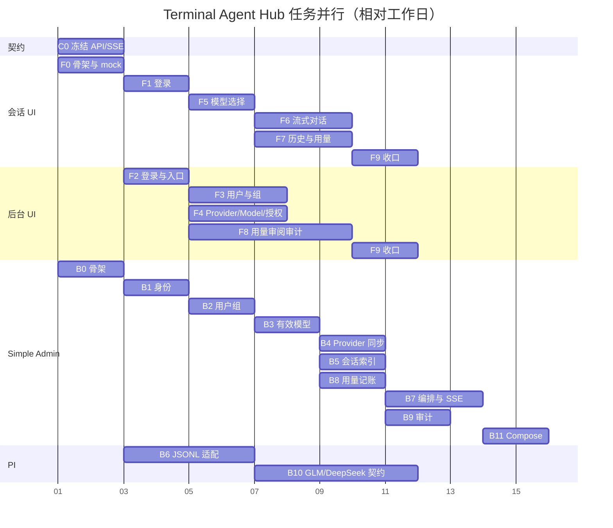

# Terminal Agent Hub 任务拆分

> 依据：[system-requirements.md](./system-requirements.md) v0.4  
> 日期：2026-09-01  
> 用法：前端、后端按任务并行开工；任务完成以本表「闭环方式」为准，不设联调验收关卡。

---

## 1. 分工原则

| 原则 | 说明 |
|---|---|
| 前端不依赖后端进程 | 会话 UI、后台 UI 各自用 mock API 跑起来，用浏览器点完本任务验收清单。 |
| 后端不依赖前端页面 | 每个后端任务用单元测试和测试脚本证明行为；协作者一律用 fake，不启动另一端。 |
| 不设集成交付闭环 | 不做「前后端联调通过才算完成」。阶段 4 把 Compose 拉起来交给产品体验；现象和问题回流后再修。 |
| 先冻结契约再并行 | 阶段 0 产出双方共用的 API / SSE / 错误码。之后前端 mock 与后端实现都对着同一份契约，互不等待。 |
| 一个任务一个 Agent | 任务粒度按「一名 Agent 可独立做完并自测」拆，不按需求 ID 逐条拆。 |

禁止事项：

- 前端任务以「等后端接口」为阻塞条件；
- 后端任务以「等页面联调」为完成条件；
- 新增「联调 / 集成验收 / e2e 对真实栈」作为交付门禁；
- 把 PI、密钥、真实 GLM/DeepSeek 塞进前端或 Simple Admin 业务库测试。

---

## 2. 阶段总览

两套前端与后端各模块在阶段 0 之后并行。阶段号只表示产品能力的叠加顺序，不表示前端要等后端做完同一阶段。

| 阶段 | 目标 | 前端 | 后端 | 交给产品体验 |
|---|---|---|---|---|
| 0 契约与骨架 | 双方能独立开工 | F0 | B0、C0 | 否 |
| 1 身份与入口 | 两套 UI 能登录，角色能分开 | F1、F2 | B1 | 否 |
| 2 组织与授权 | 用户/组/模型/授权可管理，会话 UI 能看到有效模型 | F3、F4、F5 | B2、B3、B4 | 否 |
| 3 会话与审阅 | 聊天、历史、用量、后台审阅 | F6、F7、F8 | B5、B6、B7、B8、B9 | 否 |
| 4 可拉起 | Compose 能启动，真实 Provider 可配置 | F9 | B10、B11 | **是：交给产品点，问题回流** |

开工用 **4 个 Sub Agent**。同一套 SPA 只给一个人，不要再拆前端。

| Agent | 职责 | 任务 | 不碰 |
|---|---|---|---|
| **A** | 会话 UI | F0 会话工程、F1、F5、F6、F7、F9 会话侧 | 后台、Go、PI |
| **B** | 后台 UI | F0 后台工程、F2、F3、F4、F8、F9 后台侧 | 会话 UI、Go、PI |
| **C** | Simple Admin | C0、B0、B1、B2、B3、B4、B5、B7、B8、B9、B11 | 前端、PI 进程 |
| **D** | PI | B6、B10 | 前端、用户组/授权 CRUD |

按阶段谁干什么：

| 阶段 | A | B | C | D |
|---|---|---|---|---|
| 0 | F0 会话骨架 | F0 后台骨架 | C0 契约、B0 骨架 | — |
| 1 | F1 登录 | F2 登录 | B1 身份 | B6 JSONL |
| 2 | F5 模型选择 | F3 用户组，然后 F4 授权 | B2 → B3 → B4 | B6 继续 |
| 3 | F6 对话，然后 F7 历史用量 | F8 审阅 | B5、B8、B9，B6 齐后 B7 | B6 收尾 |
| 4 | F9 收口 | F9 收口 | B11 Compose | B10 Provider 契约 |

C0 由 C 先写出 API / SSE 示例，A、B 的 mock 都对着这份契约，不要各写一套路径。只有 2 人时：A 做两套前端，C 做全部后端（含 PI）。

### 2.1 甘特图

格子是相对工作日，不是日历。同一竖条里的任务可以一起做。

---

## 3. 共用契约（阶段 0 冻结）

前端 mock 与后端测试都实现下表。细节字段在 C0 写成 OpenAPI / 事件 JSON；本表是范围，不在各任务里自行发明路径。

### 3.1 会话 UI 使用的 API

| 方法 | 路径 | 用途 | 关键错误 |
|---|---|---|---|
| POST | `/api/v1/auth/login` | 登录 | 401；禁用 403；限流 429 |
| POST | `/api/v1/auth/refresh` | 刷新 Token | 401（已撤销/用户禁用） |
| POST | `/api/v1/auth/logout` | 退出 | — |
| GET | `/api/v1/auth/me` | 当前用户与角色 | 401 |
| GET | `/api/v1/models` | 当前有效模型 | 空列表合法 |
| POST | `/api/v1/conversations` | 新建会话，body: `model_id` | 403 未授权/模型停用 |
| GET | `/api/v1/conversations` | 自己的会话列表（不含已隐藏） | — |
| PATCH | `/api/v1/conversations/{id}` | 重命名 | 404 隐藏或不存在 |
| DELETE | `/api/v1/conversations/{id}` | 对自己隐藏 | 404 |
| GET | `/api/v1/conversations/{id}/messages` | 分页读可见消息 | 403 跨用户；只读会话仍 200 |
| POST | `/api/v1/conversations/{id}/messages` | 发消息，响应 SSE | 403 无授权；409 生成中；429 并发 |
| POST | `/api/v1/conversations/{id}/abort` | 中止生成 | 409 当前无生成 |
| GET | `/api/v1/usage` | 自己的用量，query: 时间/模型 | — |

SSE 事件仅四种：`text_delta`、`usage`、`done`、`error`。`done` 与 `error` 互斥，且每请求只出现一次终止事件。

### 3.2 后台 UI 使用的 API

前缀 `/api/v1/admin`。普通用户一律 403。

| 方法 | 路径 | 用途 |
|---|---|---|
| CRUD | `/users` | 创建、编辑、禁用、重置密码 |
| CRUD | `/groups` | 用户组；成员批量加入/移除 |
| GET | `/providers` | 无密钥登记快照 |
| POST | `/providers/sync` | 手动同步 |
| GET / PATCH | `/models` | 列表；启用/停用 |
| GET / POST / DELETE | `/grants` | 用户或组的模型授权 |
| GET | `/users/{id}/effective-models` | 预览最终有效模型 |
| GET | `/usage` | 按用户、模型、时间 |
| GET | `/conversations` | 全部会话索引（含用户已隐藏） |
| GET | `/conversations/{id}/messages` | 分页正文；成功/失败都写审阅审计 |
| GET | `/audit` | 操作审计 |

登记响应字段白名单，不得出现 Key、Token 或可还原凭据。

### 3.3 后端内部边界（不对浏览器）

| 边界 | 约定 |
|---|---|
| PI | 仅 Simple Admin 经 JSONL RPC（stdin/stdout）访问 |
| Provider Key | 只在 PI 侧配置，测试用 fixture/env，不入库 |
| 会话正文 | PI Session 为事实源；MySQL 只存索引 |

---

## 4. 前端任务

闭环约定：每个任务交付可运行的页面 + mock 处理器 + 本表验收清单。开发者 `pnpm dev`（或等价命令）即可点完，不启动 Go / PI。

建议 mock 方案：Vite + MSW（或等价）。SSE 用 mock 按固定节拍推 `text_delta` → 可选 `usage` → `done`/`error`。

| ID | 阶段 | 任务 | 覆盖需求 | 页面与状态 | mock 必须覆盖 | 完成标准 |
|---|---|---|---|---|---|---|
| F0 | 0 | 双 SPA 骨架与 mock 网关 | AUTH-01、AUTH-04、SA-01 的前端侧 | 会话 UI、后台 UI 两个可启动工程；共享 mock 基址 `/api/v1` | 健康页或占位页能打到 mock | 两套 `dev` 可独立启动；契约路径有统一 mock 目录；不连真实后端 |
| F1 | 1 | 会话 UI 登录 | CU-01、AUTH-02、AUTH-03、AUTH-06 | 登录页、登录失败、禁用账号、限流提示、进入聊天壳 | 成功；密码错；用户禁用；429 冷却 | 禁用用户无法进入聊天；Cookie/Token 按契约处理；退出回到登录页 |
| F2 | 1 | 后台 UI 登录与入口 | AU-01、AUTH-02、AUTH-05 | 后台登录、无权限页、管理壳 | 管理员成功；普通用户 403；未登录跳转 | 普通用户即使用 URL 也进不了管理页；管理员进入空壳仪表盘 |
| F3 | 2 | 用户与用户组页 | AU-02、AU-03 | 用户列表/创建/编辑/禁用/重置密码；组列表/成员批量编辑 | 空列表；校验失败；禁用用户 | 管理员可走完建用户、建组、加人；表单错误有明确提示 |
| F4 | 2 | Provider / Model / 授权页 | AU-04～AU-07 | Provider 只读表；同步中/失败/过期；Model 启停；对用户/组授权；有效模型预览 | 无密钥字段；同步失败保留旧数据；新模型默认停用 | 页面不出现 Key 输入框；能完成「启用模型→授权组→预览用户有效模型」 |
| F5 | 2 | 会话 UI 模型选择 | CU-02 | 模型下拉/列表、无模型空态、发消息按钮禁用 | 有效列表；空列表；直接写死未授权 ID 时 403 提示 | 无模型时不能发消息；只展示 mock 返回的有效模型 |
| F6 | 3 | 流式对话与中止 | CU-03、CU-04、CU-05、CU-09 | 新建会话、打字增量、中止、错误气泡、生成中再发送 | 正常流；中止；`error`；409；429；XSS 载荷消息 | 增量可见；中止后不再追加；`done`/`error` 后输入恢复；Markdown 不执行脚本 |
| F7 | 3 | 历史、只读与自己的用量 | CU-06、CU-07、CU-08 | 列表、打开、重命名、软删除、刷新恢复、授权丢失只读、用量筛选 | 分页消息；隐藏后列表消失；只读仍能看历史；用量含未知 Token | 删除只是对自己消失；只读会话不能发消息；用量表可按模型/日期筛选 |
| F8 | 3 | 后台用量、会话审阅、审计 | AU-08～AU-12 | 全局用量；全量会话筛选（含已隐藏）；分页正文；审计列表 | 审阅打开正文；PI 暂不可读；无密钥 | 打开正文有「已记录审阅」的界面反馈；不渲染思考链/内部字段 |
| F9 | 4 | 前端收口 | CU-09、§9 Web 安全 | 空态/错误态补齐；CSP 相关头由页面侧可验证的部分 | 错误文案无堆栈/路径/凭据 | 两套 UI 按需求文档的展示范围收口；切真实 API 只改基址，不改页面逻辑 |

前端任务之间的依赖（仅前端内部）：

| 任务 | 依赖 |
|---|---|
| F1、F2 | F0 |
| F3、F4 | F2 |
| F5 | F1 |
| F6、F7 | F1、F5 |
| F8 | F2 |
| F9 | 本端阶段 1～3 页面都已存在 |

---

## 5. 后端任务

闭环约定：每个任务 `go test`（或该模块测试命令）必须绿。需要进程协议时，用仓库内 fake 脚本，不启动前端，默认不打真实 Provider。

协作者一律注入接口：PI 客户端、时钟、ID 生成器在测试里可替换。

| ID | 阶段 | 任务 | 覆盖需求 | 测什么 | 闭环方式 | 完成标准 |
|---|---|---|---|---|---|---|
| C0 | 0 | 冻结 API / SSE / 错误码 | SA-01、§7 | 契约文件本身 | 文档 + 示例 JSON，无运行时 | OpenAPI 或等价文档覆盖 §3；SSE 四事件有例子；403/404/409/429 语义写清 |
| B0 | 0 | Simple Admin 骨架与测试入口 | AUTH-05 部署侧预备、§9 迁移 | 空项目可测、迁移可跑 | `go test ./...`；迁移脚本 | 模块边界清楚；配置可指向测试库；尚无业务也可跑通测试命令 |
| B1 | 1 | 身份、Token、首个管理员、入口授权 | AUTH-01～06、CU-01、AU-01 | 登录、哈希、刷新、撤销、禁用后旧 Refresh 失效、登录限流、角色 | 单元测试 + HTTP 脚本打 auth API | 首个管理员可用环境变量/脚本创建；普通用户打 `/admin` 得 403；无前端 |
| B2 | 2 | 用户、组、成员 | AU-02、AU-03 | CRUD、禁用、重置密码、多组、批量成员 | 表驱动单测 + API 脚本 | 一个用户可属多组；禁用用户不能再登录（与 B1 的禁用语义一致） |
| B3 | 2 | 有效模型与授权 | SA-02、AU-06、AU-07、§5.1 | `候选 = 用户∪组`；`有效 = 候选∩启用∩Provider可用`；无 Deny；撤销后下一条消息拒绝；历史只读 | **纯函数 + 表驱动单测**（不连 PI） | 文档 §5.1 规则每条有用例；列表接口与发消息校验共用同一计算函数 |
| B4 | 2 | Provider 无密钥同步 | SA-07、AU-04、AU-05、PI-02、MP-03 | 默认停用新模型；缺失不删授权；失败保留快照并标过期；字段白名单 | fake PI 清单的单测 | 快照无密钥字段；同步失败不破坏既有授权 |
| B5 | 3 | 会话索引 | SA-05、CU-03、CU-06 | 归属、固定模型、软隐藏、管理员仍能按索引查到 | 单测 + API 脚本 | MySQL 无全文；用户列表不含隐藏；管理查询含隐藏 |
| B6 | 3 | PI JSONL 适配 | PI-01、PI-03～08、SA-06 | prompt、abort、恢复、分页读正文、工具关闭、无密钥清单 | **fake PI 进程**（stdin/stdout JSONL 脚本）+ 单测 | 不暴露 RPC 给 HTTP；abort 不误作清队列；内部控制项可被过滤函数剥掉 |
| B7 | 3 | 对话编排与 SSE | SA-03、SA-04、SA-09、§7.2 | 事件映射、`done`/`error` 互斥、同会话 409、并发 429、断线继续、120s 无连接中止、`agent_settled` 才释放 | fake PI + 单测/脚本 | 热路径逻辑可测；不需要真实模型；映射后只有四种对外事件 |
| B8 | 3 | 用量记账 | SA-08、CU-08、AU-08、MP-04 | 幂等 request ID、未知 Token 不伪造、按用户/模型/时间查询 | 单测 | 重复结束事件不计两次；缺字段标未知 |
| B9 | 3 | 审计 | SA-10、AU-11、AU-12 | 管理操作审计；审阅先写审计再读正文；失败审阅也记；脱敏 | 单测 | 每次读正文有记录；日志默认无完整正文、无 Key |
| B10 | 4 | GLM / DeepSeek 契约 | MP-01、MP-02、MP-04、PI-01、PI-07 | 普通流、401、429、5xx、超时、Usage 缺失 | **录制 fixture / mock HTTP 为门禁**；有 Key 时另附可选 live 脚本 | 默认 CI 不依赖外网和真实 Key；live 脚本单独、可跳过 |
| B11 | 4 | Compose、引导、保留期任务 | §2.3 部署、§9 部署、用户软删物理清理 | 启动、健康检查、迁移、首个管理员、重启后数据在、清理任务接口 | 测试脚本对 Compose（可本机 Docker） | 空环境按文档能起来；Key 走文件/Secret 不进命令行；无前端 e2e |

后端任务依赖（只允许代码接口依赖，测试用 fake 满足）：

| 任务 | 允许依赖 | 测试时替换为 |
|---|---|---|
| B1 | B0 | 测试库 |
| B2 | B1 的用户实体 | 测试库 |
| B3 | B2 的用户/组 | 内存授权表 |
| B4 | B3 的 Model 标识 | fake PI 清单 |
| B5 | B1 用户、B3 模型 ID | 测试库 |
| B6 | 无业务库 | fake PI 进程 |
| B7 | B3、B5、B6 的接口 | fake 授权、fake 索引、fake PI |
| B8 | B7 的 request ID | 直接调记账函数 |
| B9 | B5 读正文入口 | fake 正文服务 |
| B10 | B6 的 Provider 调用点 | mock HTTP |
| B11 | 已合并的后端可执行文件 | Docker 脚本，不测页面 |

---

## 6. 任务与需求对照

| 需求簇 | 前端任务 | 后端任务 |
|---|---|---|
| 认证与双入口 AUTH / CU-01 / AU-01 | F1、F2 | B1 |
| 用户与组 AU-02、AU-03 | F3 | B2 |
| 模型授权 §5.1 / AU-06、AU-07 / CU-02 | F4、F5 | B3、B4 |
| Provider 登记 AU-04、AU-05 | F4 | B4、B6 |
| 对话 CU-03～05、SA-03、SA-04、PI-03～06 | F6 | B6、B7 |
| 历史与软删 CU-06、CU-07 | F7 | B5、B6 |
| 用量 CU-08、AU-08、SA-08 | F7、F8 | B8 |
| 后台审阅 AU-09～11 | F8 | B5、B6、B9 |
| 操作审计 AU-12 | F8 | B9 |
| 安全渲染与错误脱敏 CU-09、§9 | F6、F9 | B7、B9 |
| GLM / DeepSeek | —（前端无感知） | B10 |
| 部署与引导 | — | B1、B11 |

V1 范围外（不要开任务）：Agent 配置、工具、RAG、MCP、CLI/TUI、编辑已发送消息、重新生成、上传、会话中途换模型、SSO、多租户。

---

## 7. 各任务验收清单（自测用）

### 7.1 前端（对着 mock 点）

| 任务 | 必须亲手点过 |
|---|---|
| F1 | 正确密码进入聊天；错密码；禁用账号；退出 |
| F2 | 管理员进后台；普通用户被拒 |
| F3 | 建用户、禁用、重置密码、建组、把用户加进两个组 |
| F4 | 打开 Provider 无 Key；同步失败仍显示旧快照；启用模型；给组授权；预览用户有效模型 |
| F5 | 有模型可选；无模型空态且发送禁用 |
| F6 | 流式出字；点停止；生成中再发送看到冲突；消息里的 `<script>` 不执行 |
| F7 | 刷新后历史还在；删除后自己的列表没了；只读会话能看不能发；用量可筛选 |
| F8 | 按用户筛会话；打开正文（含已隐藏）；审计列表出现该次审阅 |
| F9 | 错误气泡无内部路径；两套 UI 换 API 基址的配置只有一处 |

### 7.2 后端（对着测试）

| 任务 | 必须有的测试 |
|---|---|
| B1 | 禁用后 refresh 失败；登录限流；非管理员访问 admin API 403 |
| B2 | 多组membership；移除成员后组授权不再作用于该用户（可与 B3 合跑或提供数据给 B3） |
| B3 | 并集、启用、Provider 不可用、撤销立即影响发消息、管理员不自动拥有全部模型 |
| B4 | 新模型默认停用；清单缺失不删 grant；响应无 secret 字段 |
| B5 | 软删后 owner 列表空、admin 列表仍在；创建后 model_id 不可改 |
| B6 | JSONL prompt/abort/read；工具关闭；分页 |
| B7 | SSE 映射；409；429；120s 中止；settled 后才接受下一条 |
| B8 | 两次 done 只记一次；缺 Token 为未知 |
| B9 | 审阅成功/失败都有审计；无正文入库日志 |
| B10 | GLM、DeepSeek 各一条 fixture 流 + 401/429/5xx/超时 |
| B11 | compose 健康检查；重启后用户仍在；凭据文件权限脚本检查 |

---

## 8. 交给产品体验时带什么

阶段 4 完成后直接交付，不另做集成任务。交付物：

| 项 | 说明 |
|---|---|
| Compose 与文档 | 空环境启动、首个管理员引导、PI 凭据文件位置 |
| 两套 UI 的访问 URL | 会话 UI、后台 UI |
| 已知缺口 | 未确认的 §12 事项（GLM 区域、保留天数、压测硬件）写在启动说明里 |
| 回流方式 | 产品记录现象（哪套 UI、哪一步、期望/实际）；Agent 按模块修，先补该任务的单测或 mock 场景，再改代码 |

产品体验中途缺的能力，按本表任务 ID 指回对应 Agent，不要临时开「联调任务」把前后端绑在一起做完。
